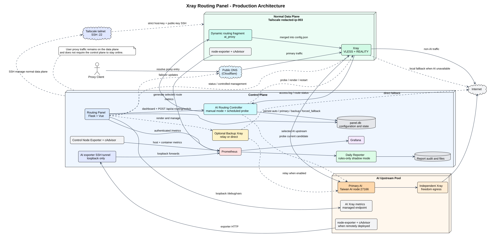

# xray-routing-panel

`xray-routing-panel` 是一个面向开发者和运维人员的 Xray REALITY 控制面，用于统一管理普通数据面、AI 节点和订阅业务。它将面板管理、节点配置同步、流量统计、AI 域名路由、DNS 故障切换和数据库备份组合成一个可部署的微服务系统。

项目的核心原则是控制面与数据面职责分离：控制面负责状态、配置编排和运维决策；数据面只负责承载代理流量和执行已下发的 Xray 配置。AI 节点是独立的受管数据面，不承载控制面逻辑。

## 项目能做什么

- 通过管理后台和 JSON API 管理监听端口、备注、到期时间、流量上限、租户凭据和订阅链接。
- 提供订阅者门户，支持客户注册登录、浏览套餐、下单、上传支付凭证、人工审核、查看订阅和续费。
- 根据数据库状态生成 `panel-ports.json`、`config.json` 等 Xray 运行配置，并校验后同步到目标节点。
- 支持 Docker、本地二进制、SSH 远端和 unmanaged 等数据面运行模式。
- 读取 Xray API 与 `access.log`，提供端口流量、连接速率、探针和节点健康状态。
- 按小时分析访问域名，生成 AI 域名路由规则、报表和数据库聚合结果。
- 将 AI 域名流量转发到独立 AI 节点；当 AI 节点不可达时自动回退到普通数据面直出。
- 通过公网 TCP 探测和 Cloudflare DNS API 实现数据面故障切换，并支持自动回切。
- 可选运行控制面备用 Xray：AI 节点正常时 relay 到 AI 节点，AI 节点也故障时切换为 freedom 直出。
- 定时备份 `panel.db`，并可选通过备份上传组件进行加密、切片、发布和恢复。

## 架构概览



[PlantUML source](docs/diagrams/system-architecture.puml) · [Detailed architecture](docs/architecture.md)

组件职责如下：

| 组件 | 职责 | 不负责的内容 |
| --- | --- | --- |
| `xray-routing-panel` | 管理用户、订单、订阅、节点状态、配置和故障切换 | 不承载普通代理流量 |
| 普通数据面 | 承载 VLESS + REALITY 流量，执行下发的监听和路由配置 | 不运行控制面 API、后台或数据库 |
| AI 节点 | 接收数据面转发的 AI 流量并 freedom 直出 | 不做域名分类，不运行控制面服务 |
| `xray-ai-domain-manager` | 从访问日志生成 AI 域名路由产物和统计 | 不管理用户和订阅 |
| `xray-reality-backup` | 数据面故障时在控制面提供备用入口 | 不替代控制面状态管理 |
| `db-backup-uploader` | 加密、切片、发布和恢复数据库备份 | 不参与代理流量转发 |

更完整的组件边界、数据流和运行产物见 [架构说明](docs/architecture.md)；故障边界见 [容错说明](docs/fault-tolerance.md)。

## 快速开始

### 运行环境

- Docker Engine 和 Docker Compose v2
- Python 3.10 或更高版本（本地非 Docker 运行时需要）
- Node.js 20 或更高版本（单独进行前端开发时需要）
- Xray REALITY 所需的域名、密钥和客户端 UUID

### 1. 生成 REALITY 参数

```bash
./app/xray/generate-secrets.sh
```

### 2. 准备配置文件

复制两个示例配置，并只在本地填写真实值：

```bash
cp .env.example .env
cp app/xray/.env.example app/xray/.env
```

`app/xray/.env` 至少需要确认以下 REALITY 参数：

- `XRAY_PUBLIC_HOST`
- `XRAY_CLIENT_UUID`
- `XRAY_REALITY_PRIVATE_KEY`
- `XRAY_REALITY_PUBLIC_KEY`
- `XRAY_REALITY_SHORT_ID`
- `XRAY_SERVER_NAME`
- `XRAY_DEST`

面板 `.env` 的常用配置包括：

- `PANEL_PUBLIC_URL`
- `PANEL_USERNAME` / `PANEL_PASSWORD`
- `PANEL_SECRET_KEY`
- `DATAPLANE_SSH_TARGET`
- `DATAPLANE_PROBE_HOST`
- `DNS_FAILOVER_ENABLED`
- `DB_BACKUP_UPLOADER_ENABLED`

完整变量说明见 [配置说明](docs/configuration.md)。`.env`、`app/xray/.env` 和任何包含私钥的文件都不应提交到 Git。

### 3. 启动服务

只启动控制面和数据库备份服务：

```bash
docker compose up -d --build
```

启动控制面、本地 Xray 和 AI 路由完整栈：

```bash
docker compose --profile xray up -d --build
```

启用控制面备用 Xray：

```bash
docker compose --profile backup-xray up -d xray-reality-backup
```

Docker 构建阶段会自动安装前端依赖并构建管理后台和订阅者门户。非 Docker 运行时需要先构建前端：

```bash
cd frontend
npm ci
npm run build
```

更多启动方式和排查命令见 [开发与启动](docs/development.md) 和 [运维说明](docs/operations.md)。

## 部署模式

### 只运行控制面

适合控制面独立运行、普通数据面部署在远端的场景：

```bash
docker compose up -d --build
```

如果控制面本机不运行 Xray，可设置 `PANEL_HEALTH_REQUIRES_XRAY=0`。

### 远端普通数据面

控制面在本地渲染和校验配置，再通过 SSH 将运行产物推送到远端数据面。至少需要配置：

```env
DATAPLANE_SSH_TARGET=root@data-plane.example.com
DATAPLANE_CONFIG_PATH=/path/to/config.json
DATAPLANE_PANEL_PORTS_PATH=/path/to/panel-ports.json
DATAPLANE_ACCESS_LOG_PATH=/path/to/access.log
DATAPLANE_PROBE_HOST=data-plane.example.com
```

远端数据面只接收配置和运行 Xray，不部署控制面 API、管理后台或面板数据库。具体拓扑和 SSH 参数见 [架构说明](docs/architecture.md)。

### 独立 AI 节点

AI 节点是独立受管的 Xray 节点，使用独立于普通数据面的 REALITY 凭据，接收普通数据面转发的 AI 流量并直接出站。SSH 状态检查和重启可独立使用；生产当前禁用自动配置上传以保护独立凭据。

详细配置、凭据字段和排障流程分别见 [AI 节点部署与 SSH 纳管](docs/ai-node-deployment.md)、[AI 节点独立凭据](docs/ai-node-credentials.md)、[AI 路由](docs/ai-routing.md)和 [ChatGPT 路由排障](docs/chatgpt-routing-troubleshooting.md)。

### DNS 故障切换

启用 DNS 故障切换前，需要准备 Cloudflare API Token、Zone ID、DNS Record ID 和探测地址。最小配置示例：

```env
DNS_FAILOVER_ENABLED=1
DNS_FAILOVER_INTERVAL=10
DNS_FAILOVER_TIMEOUT=2
DNS_FAILOVER_FAILURE_THRESHOLD=2
DNS_FAILOVER_RECOVERY_THRESHOLD=2

DNS_FAILOVER_PROBE_HOST=edge.example.com
DNS_FAILOVER_PROBE_PORT=443

CF_API_TOKEN=replace_me
CF_ZONE_ID=replace_me
CF_DNS_RECORD_ID=replace_me
CF_DNS_RECORD_NAME=edge.example.com
CF_DNS_RECORD_PROXIED=0
CF_DNS_RECORD_TTL=60
```

如需由控制面本机接管入口，还要启用 `CONTROL_PLANE_BACKUP_XRAY_ENABLED=1` 并启动 `backup-xray` profile。完整状态机、relay/直出模式和回切条件见 [DNS 故障切换](docs/dns-failover.md)。

## 默认访问地址

| 功能 | 地址 |
| --- | --- |
| 管理后台 | `http://服务器IP:18080/` |
| 订阅者门户 | `http://服务器IP:18080/portal` |
| 公共套餐页 | `http://服务器IP:18080/plans` |
| 租户订阅 | `http://服务器IP:18080/tenant/<tenant_token>` |
| 节点探针 | `http://服务器IP:18080/probe-dashboard` |
| AI 域名面板 | `http://服务器IP:18080/ai-domain-dashboard` |
| 健康检查 | `http://服务器IP:18080/healthz` |

API、认证方式和健康检查字段见 [API 文档](docs/api.md)。

## 开发与测试

安装 Python 开发依赖：

```bash
python3 -m venv .venv
. .venv/bin/activate
python -m pip install -e '.[dev]'
```

运行测试和代码检查：

```bash
python -m pytest -q
ruff check .
black --check .
```

前端开发和测试：

```bash
cd frontend
npm ci
npm run dev
npm test
```

后端、前端、Docker 和远端节点的开发流程见 [开发与启动](docs/development.md)。提交代码前请同时检查配置边界：控制面代码不应被部署到数据面，数据面运行产物也不应反向承担控制面职责。

## 文档导航

- [文档首页](docs/index.md)
- [项目概览](docs/project-overview.md)
- [架构说明](docs/architecture.md)
- [配置说明](docs/configuration.md)
- [开发与启动](docs/development.md)
- [API 文档](docs/api.md)
- [运维说明](docs/operations.md)
- [AI 节点部署与 SSH 纳管](docs/ai-node-deployment.md)
- [AI 节点独立凭据](docs/ai-node-credentials.md)
- [ChatGPT 路由排障](docs/chatgpt-routing-troubleshooting.md)
- [AI 路由](docs/ai-routing.md)
- [DNS 故障切换](docs/dns-failover.md)
- [容错说明](docs/fault-tolerance.md)
- [Kubernetes 部署](docs/kubernetes.md)
- [面板迁移](docs/panel-migration.md)
- [Prometheus-only 运维分析](docs/ops-reporting/index.md)
- [数据库备份上传](docs/db-backup-uploader.md)

## 安全与运维提示

- 不要将 `.env`、REALITY 私钥、SSH 私钥、Cloudflare Token 或数据库备份提交到仓库。
- 控制面与数据面应使用独立主机、独立部署目录和最小权限凭据。
- 修改 Xray 配置后，应先渲染和校验，再同步到数据面，并确认健康检查和流量探针恢复正常。
- 启用 DNS 故障切换前，先在测试域名上验证失败阈值、恢复阈值、TTL 和备用 Xray 端口。
- 数据库备份上传属于可选能力，生产环境应单独验证恢复流程，而不只验证备份任务成功。
