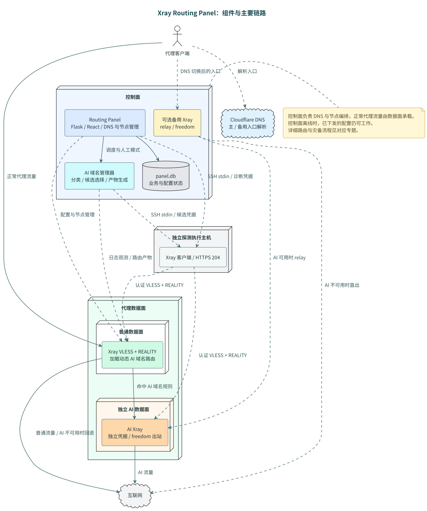
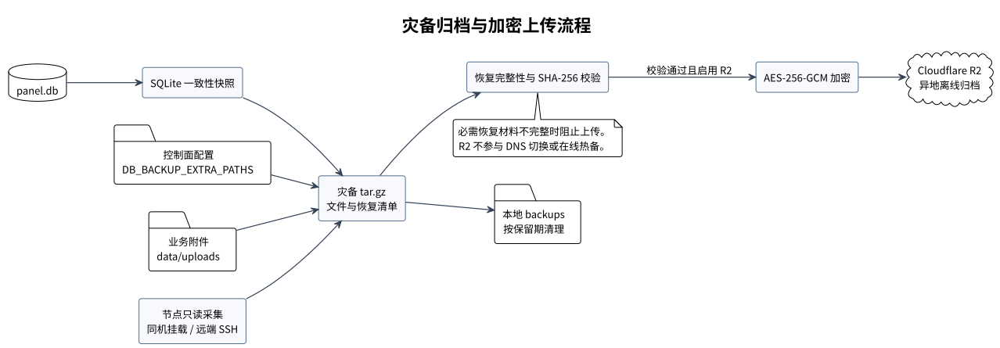

# xray-routing-panel

`xray-routing-panel` 是面向开发者和运维人员的 Xray REALITY 控制面，用于统一管理普通数据面、AI 数据面、订阅业务、流量观测、故障切换和灾备归档。

控制面负责状态、配置编排和运维决策；普通数据面只承载代理流量并执行下发配置；AI 数据面只接收 AI 路由流量并独立出站。详细介绍见[项目概览](docs/project-overview.md)。

## 核心能力

- 管理监听端口、租户凭据、套餐、订单、订阅、到期时间和流量上限。
- 生成并校验 Xray 配置，通过本地、Docker 或 SSH 模式管理数据面。
- 读取 Xray API 与访问日志，提供流量、连接速率、探针和节点健康状态。
- 识别 AI 域名并将相关流量转发到独立 AI 数据面，故障时自动回退。
- 通过 Cloudflare DNS API 实现普通数据面故障切换和自动回切。
- 使用 Prometheus、Grafana、Node Exporter 和 cAdvisor 提供可观测性与日报。
- 可选使用 Fluent Bit + Loki 通过 Tailscale 采集三节点 Docker stdout/stderr 和关键错误日志，并在 Grafana 中查询。
- 定时备份 `panel.db`、业务附件和节点实际配置，生成带完整性清单的灾备归档；可选通过 Cloudflare R2 做异地保存，并能快速准备可直接启动的替换节点目录。

## 架构概览



[PlantUML 源文件](docs/diagrams/system-architecture.puml) · [详细架构](docs/architecture.md) · [三节点容错](docs/fault-tolerance.md)

| 组件 | 单一职责 |
| --- | --- |
| `xray-routing-panel` | 用户、订单、订阅、节点状态、配置编排和故障切换 |
| 普通数据面 | 承载 VLESS + REALITY 流量并执行控制面下发的配置 |
| AI 数据面 | 接收 AI 流量并独立出站，不执行域名分类或控制面逻辑 |
| `xray-ai-domain-manager` | 从访问日志生成 AI 域名路由产物和统计 |
| `xray-reality-backup` | 普通数据面故障时提供备用入口 |
| `upload_backup_r2.py` | 使用 AES-256-GCM 加密灾备归档并通过 R2 S3 API 上传 |

## 流量与故障切换

正常运行时，普通流量由普通数据面直出，命中 AI 域名规则的流量送往独立 AI 节点：


[PlantUML 源文件](docs/diagrams/dns-primary-topology.puml) · [AI 路由与候选选择](docs/ai-routing.md#ai-上游选择)

普通数据面故障且备用能力已启用时，DNS 切到控制面备用入口；AI 节点可用时走 relay：


[PlantUML 源文件](docs/diagrams/dns-backup-relay-topology.puml) · [完整故障场景与回切](docs/dns-failover.md) · [容错边界](docs/fault-tolerance.md)

AI 候选全部不可用时，流量按所在入口回退直出。AI 候选切换与 DNS 入口切换的判定分别见上述专题。

## 灾备链路

数据库快照、配置、业务附件与节点材料组成可校验归档，启用 R2 时再加密上传：



[PlantUML 源文件](docs/diagrams/disaster-backup-flow.puml) · [灾备归档](docs/disaster-backup.md) · [完整恢复准备](docs/node-recovery.md#完整灾备包恢复脚本)

R2 保存离线归档，恢复脚本先准备隔离目录；服务替换与流量切换仍需人工验收。

## 快速开始

### 环境要求

- Docker Engine 和 Docker Compose v2
- Python 3.10+（仅本地运行或开发需要）
- Xray REALITY 所需域名、密钥和客户端 UUID

### 1. 生成 REALITY 参数

```bash
./app/xray/generate-secrets.sh
```

### 2. 准备配置

```bash
cp .env.example .env
cp app/xray/.env.example app/xray/.env
```

在本地填写真实值，不要提交 `.env`、REALITY 私钥、Cloudflare Token 或数据库备份；SSH 纳管使用内网直连，不需要提交 SSH 私钥。变量说明见[配置说明](docs/configuration.md)。

### 3. 启动服务

仅启动控制面和数据库备份服务：

```bash
docker compose up -d --build
```

启动控制面、本地 Xray 和 AI 路由完整栈：

```bash
docker compose --profile xray up -d --build
```

启用控制面备用 Xray：

```bash
docker compose --profile backup-xray up -d xray-reality-backup
```

更多模式和排障命令见[开发与启动](docs/development.md)和[运维与排障](docs/operations.md)。

日志采集、远端节点纳管和灾备配置分别见[日志采集](docs/logging-fluent-bit.md)、[内网 SSH 纳管](docs/ssh-key-access.md)和[灾备归档](docs/disaster-backup.md)。

### 默认访问地址

控制台没有登录，只有内网和 Tailscale 来源可访问（见[控制面访问与来源白名单](docs/panel-access.md)）；下表地址均按控制面内网或 Tailscale 地址访问。

| 功能 | 地址 |
| --- | --- |
| 管理后台 | `http://服务器IP:18080/` |
| 订阅者门户 | `http://服务器IP:18080/portal` |
| 公共套餐页 | `http://服务器IP:18080/plans` |
| 租户订阅 | `http://服务器IP:18080/tenant/<tenant_token>` |
| 节点探针 | `http://服务器IP:18080/probe-dashboard` |
| AI 域名面板 | `http://服务器IP:18080/ai-domain-dashboard` |
| 健康检查 | `http://服务器IP:18080/healthz` |

页面、认证和 JSON API 见 [API 文档](docs/api.md)。

## 开发与验证

开发环境、后端测试、前端构建和 CI 检查统一见[开发与启动](docs/development.md)。

## 完整文档导航

本节是项目唯一完整文档导航。详细说明保存在 `docs/`，各专题通过交叉链接引用相关内容。

### 开始使用

- [仓库当前状态](docs/Repo_Current_State.md) — 已核实的实现、验证限制与当前工作状态。
- [项目概览](docs/project-overview.md) — 项目定位、能力边界、阅读顺序和代码入口。
- [架构说明](docs/architecture.md) — 控制面、普通数据面、AI 数据面、组件边界和数据流。
- [配置说明](docs/configuration.md) — 根 `.env`、Xray 环境变量及各模块配置。
- [开发与启动](docs/development.md) — 本地开发、Docker 启动、测试和调试。
- [文档与图表维护约定](docs/documentation.md) — 文档归属、状态标记和 PlantUML 本地渲染。

### 部署、凭据与迁移

- [AI 节点部署与 SSH 纳管](docs/ai-node-deployment.md) — 独立 AI 数据面的部署和控制面纳管。
- [AI 节点独立凭据](docs/ai-node-credentials.md) — AI inbound/outbound 凭据边界和轮换要求。
- [控制面访问与来源白名单](docs/panel-access.md) — Tailscale/内网直连、无登录控制台和 403 边界。
- [内网 SSH 纳管](docs/ssh-key-access.md) — 控制面直连普通数据面的认证、主机指纹校验与验证。
- [Clash 统一 443 入口](docs/unified-entry.md) — 新旧订阅兼容、HAProxy 网关、计费与回退。
- [面板迁移](docs/panel-migration.md) — 控制面数据、配置和服务迁移流程。
- [AWS 普通数据面迁移与回退](docs/aws-normal-data-plane-migration.md) — 普通数据面灰度迁移、AWS 安全组门禁和回退步骤。

### 运行、接口与故障处理

- [运维与排障](docs/operations.md) — 健康检查、监控、备份和常见故障处理。
- [API 与页面路径](docs/api.md) — 页面、认证、订阅接口和 JSON API。
- [Fluent Bit 日志采集](docs/logging-fluent-bit.md) — 三节点 Docker/Xray 关键日志经 Tailscale 到远端 Loki 和 Grafana。
- [三节点故障容错](docs/fault-tolerance.md) — 控制面、普通数据面和 AI 数据面的故障边界。
- [DNS 故障切换](docs/dns-failover.md) — 探测、Cloudflare DNS 切换、备用 Xray 和自动回切。
- [ChatGPT 路由排障](docs/chatgpt-routing-troubleshooting.md) — 客户端、入口、路由、AI 节点和出口的分层排查。
- [Clash REALITY 健康检查超时排障](docs/troubleshooting/clash-reality-health-check-timeout.md) — TCP 可达但完整 REALITY 握手失败时的分层诊断、修复和验收记录。

### AI 路由与备份

- [AI 路由](docs/ai-routing.md) — 域名分类、动态规则、AI 上游选择和故障回退。
- [灾备归档与 R2 上传通道](docs/disaster-backup.md) — 配置文件等额外内容的归档、R2 异地保留和离线恢复边界。
- [节点配置采集](docs/remote-node-backup.md) — 同机普通数据面使用 broker 只读挂载，远端节点使用严格只读 SSH；本机 AI 配置随控制面归档。
- [节点备份完整性与快速恢复](docs/node-recovery.md) — 节点必需材料校验和可直接启动的替换目录。
- [Cloudflare R2 灾备上传](docs/db-backup-uploader.md) — 加密上传、对象命名、安全边界和人工恢复。

### Prometheus-only 运维分析

- [模块边界](docs/ops-reporting/index.md) — 模块职责与历史部署记录。
- [Exporter 部署与网络隔离](docs/ops-reporting/exporter-deployment.md) — Node Exporter、cAdvisor 和网络访问边界。
- [Prometheus Targets 与 Labels](docs/ops-reporting/prometheus-targets.md) — 抓取目标、标签及查询约束。
- [故障判定规则边界](docs/ops-reporting/fault-classification.md) — 可判定能力、证据组合和 unknown 边界。
- [每日日报器](docs/ops-reporting/daily-reporter.md) — 日报生成流程和职责边界。
- [报告契约](docs/ops-reporting/report-contract.md) — 报告结构、字段和输出约束。
- [报告运行审计与历史归档](docs/ops-reporting/report-run-audit.md) — SQLite 审计记录和保留边界。
- [灰度发布与回滚](docs/ops-reporting/rollout.md) — 分阶段发布、观察期和回滚条件。
- [验收标准](docs/ops-reporting/acceptance.md) — 上线门禁和验收指标。
- [故障排查](docs/ops-reporting/troubleshooting.md) — Target、AI 监控和日报异常处理。

### 历史与停用文档

以下文档用于追溯历史决策，不代表当前推荐部署方式：

- [REALITY dest 修复与多端口迁移历史](docs/reality-dest-migration-history.md) — 历史生产修复和验证记录。
- [Prometheus-only 生产部署状态](docs/ops-reporting/deployment.md) — 历史部署状态记录；现行行为见每日日报器。
- [SSH 日志采集器停用说明](docs/ops-reporting/log-collector.md) — 已停用方案及迁移背景。

## 安全边界

- 不提交 `.env`、REALITY 私钥、Cloudflare Token、数据库快照或灾备归档；SSH 纳管不需要私钥。
- 控制面与数据面应使用独立主机、独立目录和最小权限凭据。
- Xray 配置必须先渲染和校验，再同步并确认健康检查、探针和监控恢复。
- Node Exporter、cAdvisor、Grafana、Loki、Fluent Bit 和管理接口应限制到受信任网络。
- 数据库备份不能只验证任务成功，还应定期验证实际恢复流程。
