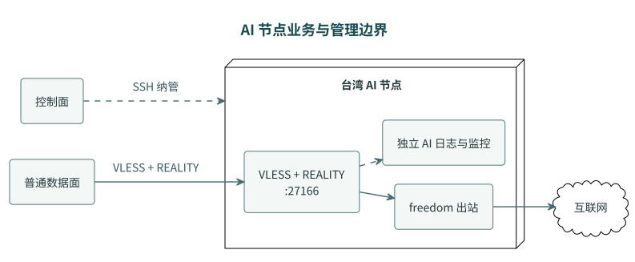
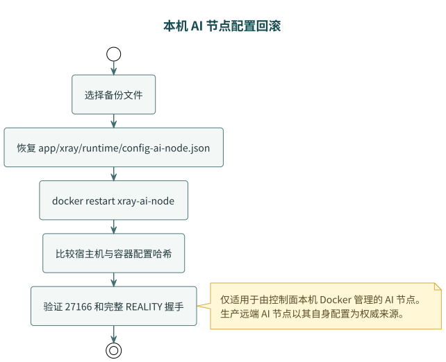

# AI 节点部署与纳管

> Type: Runbook
> Status: Active
> Scope: AI 节点部署、SSH 管理、日志指标读取与受控配置同步

## 模块职责

AI 节点运行独立的 VLESS + REALITY Xray，接收主数据面转发的 AI 域名流量并通过 `freedom` 直出。本文件说明可选的本机 Docker 节点，以及显式启用远端 SSH 节点时的边界。

凭据匹配规则见 [AI 节点独立凭据](ai-node-credentials.md)，ChatGPT 故障处理见 [ChatGPT 路由排障](chatgpt-routing-troubleshooting.md)。

## 当前拓扑



[PlantUML 源文件](diagrams/ai-node-deployment.puml)

两个端点职责不同：

| 端点 | 用途 |
| --- | --- |
| 台湾 AI 节点 `:27166` | 当前唯一 AI 主节点，使用独立 REALITY 凭据 |

禁止使用已下线的旧 AI 上游 `isif.217777.xyz:42994`。

## AI 上游选择

主数据面不会同时把 AI 流量发往两个节点，而是由控制面生成的 `ai_proxy` 动态路由选择一个候选：

- `auto`：按主、备顺序探测，选择第一个可达候选；当前生产只有台湾主候选；
- `primary`：人工固定主 AI，主节点不可达时报告 `manual_target_unreachable`，不静默改用备用；
- `backup`：人工固定配置的备用 AI，备用不可达时同样停用动态 AI 路由；
- `forced_fallback`：人工停用动态 AI 路由，AI 域名回到普通数据面 `freedom` 直出。

控制台会展示当前配置的 AI 候选探测状态、当前选中节点和 `manual_mode`。人工切换先触发管理器应用目标模式，
成功后才写入控制面 `app_state`；失败时保留旧模式。

## 本机 Docker 模式（可选）

| 项目 | 示例值 |
| --- | --- |
| 部署方式 | Docker |
| 容器名 | `xray-ai-node` |
| 配置源 | `app/xray/runtime/config-ai-node.json` |
| 容器内配置路径 | `/etc/xray/config.json` |
| 业务监听端口 | `27166` |

生产切换目标为远端台湾 AI 节点；只有未配置远端目标且需要本机承载 AI 节点时，才启用本节的 Docker 模式。

AI 节点使用 `AI_NODE_*` 独立 UUID、REALITY 私钥、公钥和 Short ID，不能复用普通数据面的 `XRAY_*` 凭据。

## 本地日志与业务检查

AI 节点的 `ai-access.log` 和 `ai-error.log` 保留在节点本机，供必要的业务排障使用。受管日志路径由 [配置说明](configuration.md#AI-节点纳管变量) 中的 `AI_NODE_ACCESS_LOG_PATH` 指定。本机 Docker 模式下从控制面验证：

```bash
docker inspect xray-ai-node --format '{{.State.Running}}|{{.State.Status}}|{{.State.StartedAt}}'
docker exec xray-ai-node /usr/local/bin/xray run -test -config /etc/xray/config.json
stat app/xray/logs/ai-access.log app/xray/logs/ai-error.log
```

域名分类与小时报告读取普通数据面的 `access.log`；统计和路由职责见 [AI 路由](ai-routing.md)。

## SSH 认证边界

本机 Docker 节点不需要 SSH。生产切换目标为远端台湾 AI 节点时，控制面直接通过内网 SSH 连接目标主机，
不挂载或传递私钥：

控制面通过 SSH 直连普通数据面 `<normal-data-plane-host>:22`；认证和主机指纹要求见[内网 SSH 纳管](ssh-key-access.md)。

远端 SSH 纳管时强制：

```text
PubkeyAuthentication=no
PreferredAuthentications=password,keyboard-interactive
PasswordAuthentication=yes
KbdInteractiveAuthentication=yes
StrictHostKeyChecking=yes
UserKnownHostsFile=/root/.ssh/known_hosts
```

`known_hosts` 只用于校验主机指纹，不是登录私钥。密码认证由 SSH 会话处理，应用不保存密码。
完整配置见 [内网 SSH 纳管](ssh-key-access.md)。

## 根 `.env` 配置

示例只配置 SSH 目标，不保存密码：

```env
AI_NODE_SSH_TARGETS=root@<taiwan-ai-host>
AI_NODE_IDS=taiwan
AI_NODE_LABELS=AI 台湾
AI_NODE_CONTAINER_NAMES=xray-ai-node
AI_NODE_API_SERVERS=127.0.0.1:27166
AI_NODE_CONFIG_PATHS=
```

关键语义：

- `AI_NODE_API_SERVERS=127.0.0.1:27166`：远端 AI 节点通过 SSH 执行本机 TCP 业务端口检查。
- `AI_NODE_CONFIG_PATH=`：显式留空会使 `supports_sync=false`，禁止控制面上传配置。
- `AI_NODE_CONTAINER_NAMES=xray-ai-node` 提供远端容器状态检查和重启能力。

## 多台远端 AI 节点

需要同时纳管多台远端节点时，使用逗号或换行分隔的列表变量；各列表按相同顺序一一对应。
面板会在 Dashboard 和“基础设施”页分别展示每台节点，并允许单独重启：

```env
AI_NODE_SSH_TARGETS=root@<ai-node-a-host>,root@<ai-node-b-host>
AI_NODE_IDS=ai-node-a,ai-node-b
AI_NODE_LABELS=AI 节点 A,AI 节点 B
AI_NODE_CONTAINER_NAMES=xray,xray-ai-node
AI_NODE_API_SERVERS=127.0.0.1:27166,127.0.0.1:27166
AI_NODE_CONFIG_PATHS=
```

`AI_NODE_CONFIG_PATHS=` 保持为空时，控制面只做 SSH 状态检查和容器重启，不上传共享配置；两台远端 Xray 的独立凭据和配置仍由各自节点负责。
旧的单节点变量仍可用于兼容部署。逐节点重启 API 为
`POST /api/ai-nodes/<node_id>/restart`。

## `app/xray/.env` 上游配置

```env
AI_UPSTREAM_HOST=<taiwan-ai-host>
AI_UPSTREAM_PORT=27166
# 当前唯一节点沿用带独立 REALITY 凭据的 AI_UPSTREAM_FALLBACK_URL，并提升为主候选
AI_UPSTREAM_FALLBACK_AS_PRIMARY=1
```

`AI_UPSTREAM_HOST` / `AI_UPSTREAM_PORT` 定义主候选；当前生产仅保留台湾 AI 节点。带独立凭据的分享链接通过
`AI_UPSTREAM_FALLBACK_URL` 配合 `AI_UPSTREAM_FALLBACK_AS_PRIMARY=1` 提升为主候选。端点变量不能替代
AI 节点独立的 UUID、REALITY 密钥、Short ID 和 SNI。

## 为什么默认禁用配置上传

AI 节点当前使用独立 REALITY 凭据。控制面生成的 `config-ai-node.json` 若复用主数据面 `XRAY_*` 凭据，会破坏主数据面现有 VLESS outbound 与 AI inbound 的认证匹配。

因此生产默认保持：

```env
AI_NODE_CONFIG_PATH=
```

远端 AI 节点保留各自独立配置；`AI_NODE_CONFIG_PATHS` 留空可避免面板把控制面配置误当作远程路径上传。

## 受控配置同步流程

启用同步前必须完成以下步骤：

1. 确认 `app/xray/.env` 中存在独立 `AI_NODE_*` 凭据。
2. 使用同版本 Xray 执行 `run -test`。
3. 重启 `xray-ai-node` 容器。
4. 验证容器运行、`27166` 可达以及 ChatGPT 实际请求成功。

任一步失败都应恢复备份并重启容器。

## 日常检查

```bash
# 控制面健康状态
curl -fsS http://redacted-ip-007:18080/healthz

# AI 备用容器状态
docker inspect xray-ai-node --format '{{.State.Running}}|{{.State.Status}}|{{.State.StartedAt}}'

# 业务端口
nc -zv redacted-ip-004 27166
```

预期 `/healthz`：

```json
{
  "ok": true,
  "data_plane_running": true,
  "ai_node_running": true
}
```

## 回滚

回滚使用控制面运行时配置，不涉及远端宿主机路径：



[PlantUML 源文件](diagrams/ai-node-rollback.puml)

备份文件包含敏感凭据，权限必须为 `0600`，不得提交到 Git 或复制到日志、工单和聊天记录。
