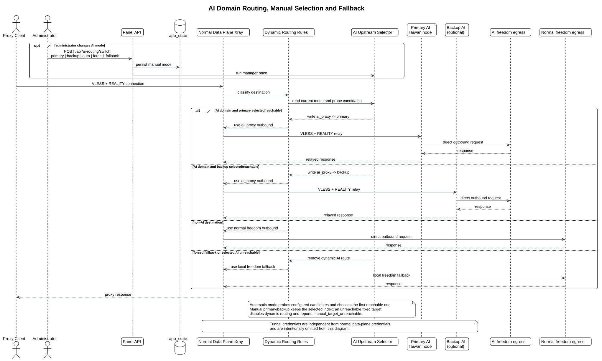

# AI 路由

## 主链路

AI 路由由 `xray-ai-domain-manager` 驱动（运行在普通数据面上），默认流程如下：



[查看 PlantUML 源文件](diagrams/ai-routing-flow.puml)

1. 从 `app/xray/logs/access.log` 读取最近一小时访问域名
2. 先应用内建 AI 域名规则
3. 对未知域名优先调用本机 `codex`
4. 如 `codex` 不可用，再回退到 OpenAI 兼容接口
5. 生成动态路由、小时报表和数据库聚合结果
6. 路由变化时重新渲染并重启数据面

AI 域名流量最终由 `dynamic-routing.json` 送入 `ai_proxy` VLESS + REALITY outbound，再转发到远端 AI 节点并由其 freedom 直出。该 outbound 必须使用与 AI 节点独立 inbound 完整匹配的凭据，不能从普通数据面 `XRAY_*` 盲目派生。AI 节点不可达时自动回退到数据面直出，详见下方“AI 上游选择”、[AI 节点独立凭据](ai-node-credentials.md)和 [AI 节点部署与 SSH 纳管](ai-node-deployment.md)。

## 输入与输出

输入：

- `app/xray/logs/access.log`
- `app/xray/.env`
- 可选 `app/xray/ai-proxy-outbound.json`

输出：

- `app/xray/runtime/ai-domain-decisions.json`
- `app/xray/runtime/dynamic-routing.json`
- `app/xray/reports/hourly-domains/latest.json`
- `app/xray/reports/hourly-domains/latest.txt`
- `data/panel.db` 中的 `ai_domains` 和 `ai_domain_observations`

## AI 上游选择

AI 上游即 AI 节点的公网入口地址。常见配置方式有两种：

- 主上游 + 追加备用：
  - `AI_UPSTREAM_HOST`
  - `AI_UPSTREAM_PORT`
  - `AI_UPSTREAM_FALLBACKS`
- 直接提供完整优先级列表：
  - `AI_UPSTREAMS`

主 AI 上游也可能使用独立的 UUID、REALITY 公钥、Short ID 和 SNI。主数据面 `ai_proxy` outbound 与 AI inbound 的字段契约见 [AI 节点独立凭据](ai-node-credentials.md)。备用上游使用不同凭据时，应提供完整且受保护的分享链接：

- 使用 `AI_UPSTREAM_FALLBACK_URL`

配置 `AI_NODE_SSH_TARGET` 只代表控制面能够纳管节点，不证明隧道凭据匹配，也不会安全地产生 relay URL。启用控制面备用 relay 时，必须显式提供与 AI inbound 匹配的 `CONTROL_PLANE_BACKUP_UPSTREAM_URL`；否则保持 relay 能力关闭。

管理器优先从普通数据面探测 AI 上游。模板或分享链接提供 REALITY SNI 时执行握手探测，否则使用 TCP 探测；首个不可达时切换到下一个可达上游。

远端数据面模式必须配置 `DATAPLANE_SSH_KEY_FILE`。Compose 默认将运维密钥挂载到 `/run/secrets/fleet_ssh_key`，并强制使用 `IdentitiesOnly=yes`，避免 SSH 因尝试过多身份而无法同步配置。

如果所有 AI 上游都不可达：

- 不再下发 `ai_proxy` 动态路由
- 删除 `dynamic-routing.json`（`ai_domain_manager.py:1675`）
- 已命中的 AI 域名会回退到主链路流量（数据面 freedom 直出）
- 报表中的 `route_status` 会标记为 `fallback_to_primary`
- 回退判断由 `should_fallback_to_primary_route()`（`ai_domain_manager.py:1183`）完成
- **此回退不涉及 DNS 切换**

管理员也可以在控制台总览中主动执行“强制回退”。该模式会写入控制面数据库的 `app_state`，由 AI 管理器每轮读取并保持 `dynamic-routing.json` 不存在；点击“恢复自动”后，下一轮管理器重新按照 AI 上游探测结果决定是否生成动态路由。API 形式见 [API 与页面路径](api.md)。

如果普通数据面管理通道本身探测失败，报告会标记 `probe_error`，并停止继续下发 AI 动态路由；修复 SSH 后下一轮会重新探测并恢复或回退。

AI 节点恢复后，下一轮探测到可达，重新生成 `dynamic-routing.json`，AI 流量恢复转发到 AI 节点。

## 代理模板

仓库默认提供：

- `app/xray/ai-proxy-outbound.json`

模板中的这些占位符会在运行时替换：

- `__AI_UPSTREAM_HOST__`
- `__AI_UPSTREAM_PORT__`
- `__PANEL_UPSTREAM_HOST__`
- `__PANEL_UPSTREAM_PORT__`
- `__PANEL_LISTEN_PORT__`

如果模板不存在，管理器会回退到内建 `freedom redirect`。

## Codex / OpenAI 兼容分类器

默认 compose 会挂载宿主机这些路径，以便容器调用本机 `codex`：

- `/root/.codex`
- `/root/.nvm/versions/node`

如果你的环境不是这些路径：

- 调整 `docker-compose.yml` 中的挂载
- 或在 `app/xray/.env` 中设置 `CODEX_CLI_JS` / `CODEX_BIN`

如果没有可用的 `codex` 或 OpenAI 兼容接口：

- 内建已知 AI 域名仍会命中
- 未知域名不会自动得到 AI / 非 AI 分类

## MCP 工具

仓库自带一个辅助 MCP server：

```bash
python -m app.xray.google_search_mcp
```

它不是主链路的自动步骤，只用于辅助人工或半自动归类。默认提供：

- `collect_uncategorized_domains`
- `search_domains_with_google`
- `classify_domains_with_google`

Google 搜索层直接抓取搜索结果页，不依赖 Google Search API；分类默认使用 OpenRouter 上的 `openai/gpt-5-nano`。

## 常用命令

手动跑一轮 AI 域名分析：

```bash
docker compose --profile xray run --rm xray-ai-domain-manager python -m app.xray.ai_domain_manager --once
```

查看 AI 管理器日志：

```bash
docker compose --profile xray logs -f xray-ai-domain-manager
```

查看最新报告：

```bash
cat app/xray/reports/hourly-domains/latest.txt
sed -n '1,220p' app/xray/reports/hourly-domains/latest.json
```

## 源码与运行目录

`app/xray/` 是 AI 路由和 Xray 配置子系统的代码目录，文档统一维护在本目录。常用入口如下：

- `render_config.py`：渲染 `config.json`、`client-test.json` 和分享链接
- `ai_domain_manager.py`：域名分类、动态路由、小时报表
- `google_search_mcp.py`：辅助归类用 MCP server
- `runtime/`：渲染产物和运行时缓存
- `reports/`：小时域名报告
