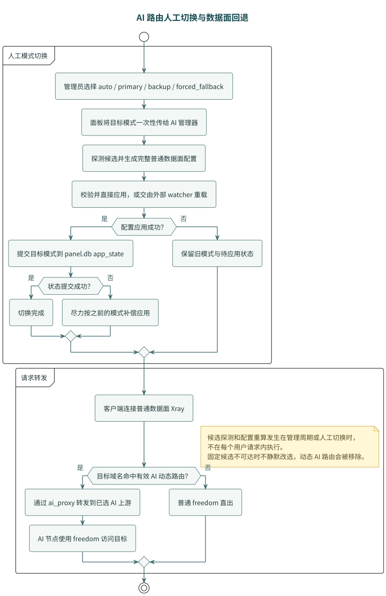
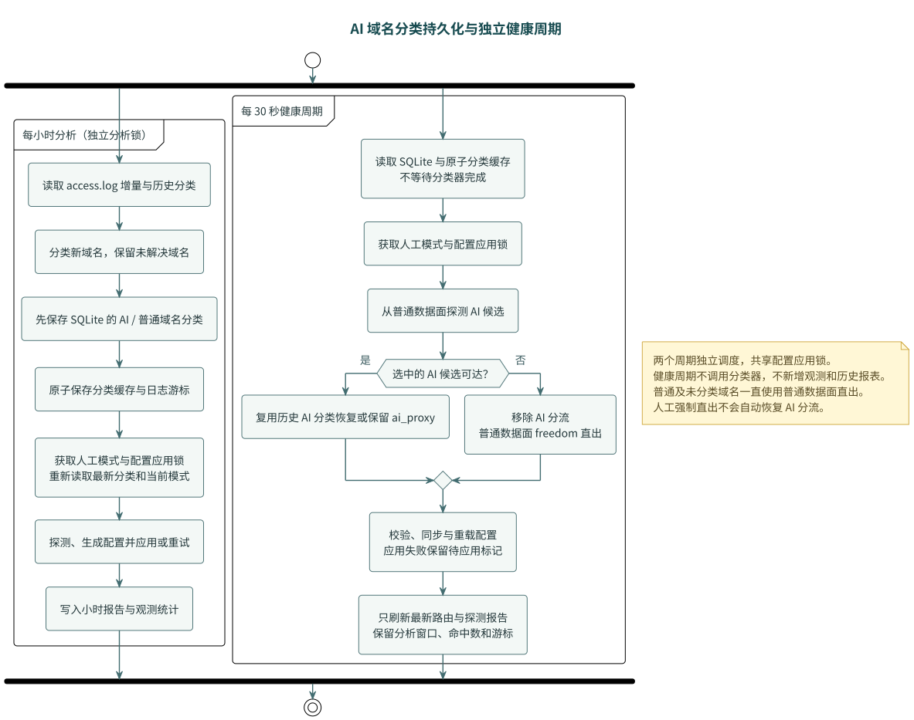
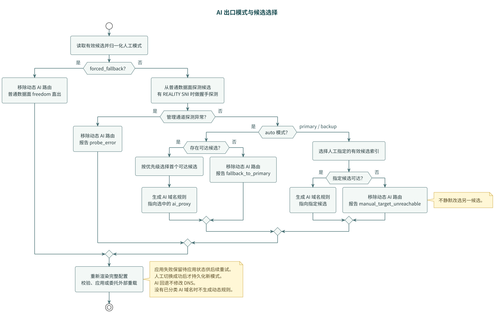

# AI 路由

> Type: Architecture
> Status: Active
> Scope: 域名观测与分类、AI 候选选择、动态路由产物和故障回退

## 主链路

AI 路由由控制面容器中的 `xray-ai-domain-manager` 驱动，通过内网 SSH 或共享工作目录管理普通数据面，默认流程如下：



[查看 PlantUML 源文件](diagrams/ai-routing-flow.puml)



[PlantUML 源文件](diagrams/ai-hourly-analysis.puml)

1. 每小时读取最近一小时普通数据面 `access.log`；远端 SSH 模式直接在数据面读取，避免把整份日志复制到控制面
2. 先应用内建 AI 域名规则
3. 对未知域名调用 OpenRouter 分类器
4. 分类失败的域名保留待分类状态，已有分类记录继续使用
5. 所有已知 `ai` / `not_ai` 分类先持久化到 `panel.db` 的 `ai_domain_classifications`；仅将已观测 AI 域名的命中统计写入 `ai_domains` 和 `ai_domain_observations`
6. 默认生成只包含 AI 域名的动态路由、小时报表
7. 探测主、备 AI 候选并按当前模式选择目标
8. 路由变化时重新渲染并重启数据面

健康周期默认每 30 秒独立执行，小时分类在单独的分析线程和锁下运行，不持有配置应用锁等待分类器。健康周期从 SQLite 与原子分类缓存复用已知域名，探测、应用回退或恢复配置，只更新最新路由报告；不读取日志、不调用分类器、不新增小时观测或历史报告。分类阶段完成后，再在人工模式锁与配置应用锁内重新读取当前分类和模式应用配置。

JSON 分类缓存缺失或损坏时从数据库恢复；已有 `ai_domains` 也可作为旧版本历史分类来源。缓存保存 AI 和普通域名分类、来源、原因与分类时间，避免故障后重新调用分类器。外部配置应用失败不会撤销已保存分类；AI 上游全部不可达时，已分类 AI 域名回到普通数据面 freedom 直出，自动模式在候选恢复可达后复用历史分类重新分流。

内建强制 AI 域名族覆盖 ChatGPT/OpenAI（`chatgpt.com`、`openai.com`、`oaistatic.com`、`oaiusercontent.com`）、Claude/Anthropic（`claude.ai`、`anthropic.com`、`claude.com`、`claudeusercontent.com`）和 AWS。AWS 规则覆盖服务端点（`amazonaws.com`、`amazonaws.com.cn`、`amazonwebservices.com.cn`、`api.aws`、`on.aws`）、控制台与静态资源（`aws.amazon.com`、`awsstatic.com`、`awsplayer.com`、`awscloud.com`）、Identity Center（`awsapps.com`、`awsapps.cn`）以及 AWS 专用域名族（`aws.dev`、`aws`、`aws.a2z.com`、`aws.a2z.org.cn`）。这些域名的子域名也会匹配；`amazon.com`、`cloudfront.net` 和 `live-video.net` 属于共享范围较大的域名族，未纳入全量规则，以免把非 AWS 流量一并转发；实际观测到的域名才写入数据库聚合表。

AI 域名流量最终由 `dynamic-routing.json` 送入 `ai_proxy` VLESS + REALITY outbound，再转发到选中的 AI 上游并由其 freedom 直出。默认 classified 范围下，非 AI 域名以及尚未完成分类的域名不进入动态规则，继续使用普通 DMIT 数据面的默认 `freedom` outbound 直出。该 outbound 必须使用与对应 AI inbound 独立且完整匹配的凭据，不能从普通数据面 `XRAY_*` 盲目派生。当前生产仅保留台湾 AI 节点作为主候选 `redacted-ip-004:27166`；原主候选 `nat.qq.pw:27166` 已移除，不再作为备用候选。

## 转发范围

控制台「AI 转发范围」按端口提供可逆的「全部转发到 AI 节点」开关。每个端口可独立选择 `all` 或 `classified`，也可恢复默认策略；
未单独设置的端口沿用全局默认。默认 `classified` 保持域名分流；
`all` 将进入托管租户入口的 TCP/UDP 代理流量转发到所选 AI 上游，包含普通域名、未分类域名和 IP 目标，
即使没有已分类 AI 域名也生效。渲染器按账号绑定当前 `panel-*` 和 `unified-*` 租户入口；未单独设置的新增账号沿用全局默认，健康周期重新应用；
API/管理入口不参与全量规则，静态阻断规则（包括启用时的 UDP 443 / QUIC 阻断）仍优先。
客户端订阅中的 DIRECT 流量不经过服务器，此设置无法接管，也不会改写订阅规则。

全局默认保存在 `app_state.ai_routing_traffic_scope`；端口覆盖保存在 `ports.ai_traffic_scope`（空值表示沿用默认），绑定稳定账号 ID。改号保留账号偏好，删除并复用端口不继承旧账号设置。
全量规则分别匹配旧入口的 `panel-<port>` 与统一入口的认证 `panel-user-<port>`，不会捕获统一 443 的其他账号；渲染时以当前账号清单重绑身份。账号限流标记在这些路由选择后继续生效。
范围独立于 `auto` / `primary` / `backup` / `forced_fallback`。
应急直出优先于范围，但保留范围偏好；AI 不可达时沿用已有回退，恢复后重新应用所选范围。
人工请求持有共享人工配置锁，先调用管理器应用范围，再提交数据库；提交失败尽力补偿旧范围。
显式范围应用失败恢复旧片段与配置；无法确认补偿重载时保留 pending 标记并将报告应用状态设为未知。

报告 `route_status.traffic_scope` 表示本次请求的范围，`applied_traffic_scope` 表示确认配置的
`classified` / `all` / `mixed` / `direct`，委托外部重载时为 `unknown`。
`requested_port_scopes` 与 `applied_port_scopes` 保存账号 ID、端口、有效范围和启用状态；面板逐端口比较，旧报告或状态不匹配时显示待确认。
混合范围下，普通域名的汇总出口标记为按端口选择，具体出口以端口应用状态为准。控制台同时显示保存偏好与应用状态；
仅保存或委托同步不表示已生效。管理执行器错误保留此前路由，标记 `route_preserved`；它不证明上游不可达。
拓扑中的全量 AI 路径不将普通直出标为活动出口，域名报告仍保留分类来源并按实际应用范围展示出口。

## 输入与输出

手动强制回退同样通过域名管理器重新渲染完整配置、同步并重载数据面，不仅删除动态片段。
配置完整渲染并通过校验后，会在配置文件旁创建 `<配置文件名>.pending-apply` 标记；应用失败时保留，
后续管理周期即使配置内容未变化也会重试重载，外部 reloader 在确认新进程运行后清除。备用节点重启
返回失败或超时时，端口事务补偿也会尝试重新加载原备用配置。管理器还会使用共享运行目录中的文件锁，
避免常驻周期任务与手动 `--once` 同时改写配置。以上恢复依赖管理进程继续运行及节点重新可达。

输入：

- 普通数据面 `access.log`（SSH 模式由 `DATAPLANE_ACCESS_LOG_PATH` 指定；留空时可从 `DATAPLANE_CONFIG_PATH` 推导）
- `app/xray/.env`
- 可选 `app/xray/ai-proxy-outbound.json`

输出：

- `app/xray/runtime/ai-domain-decisions.json`
- `app/xray/runtime/dynamic-routing.json`
- `app/xray/reports/hourly-domains/latest.json`
- `app/xray/reports/hourly-domains/latest.txt`
- `data/panel.db`：`ai_domains` / `ai_domain_observations` 保存已观测 AI 域名统计；`ai_domain_classifications` 保存所有已知 AI / 普通域名分类，供路由恢复复用。

## AI 上游选择



[PlantUML 源文件](diagrams/ai-upstream-selection.puml)

AI 上游即 AI 节点的公网入口地址。常见配置方式有两种：

- 主上游 + 追加备用：
  - `AI_UPSTREAM_HOST`
  - `AI_UPSTREAM_PORT`
  - `AI_UPSTREAM_FALLBACKS`
- 直接提供完整优先级列表：
  - `AI_UPSTREAMS`

主 AI 上游也可能使用独立的 UUID、REALITY 公钥、Short ID 和 SNI。主数据面 `ai_proxy` outbound 与 AI inbound 的字段契约见 [AI 节点独立凭据](ai-node-credentials.md)。备用上游使用不同凭据时，应提供完整且受保护的分享链接：

- 使用 `AI_UPSTREAM_FALLBACK_URL`
- 如果该分享链接对应当前唯一节点，将 `AI_UPSTREAM_FALLBACK_AS_PRIMARY=1`，管理器会把它提升为候选 0，并保留链接中的独立 REALITY 凭据。

配置 `AI_NODE_SSH_TARGET` 只代表控制面能够纳管节点，不证明隧道凭据匹配，也不会安全地产生 relay URL。启用控制面备用 relay 时，必须显式提供与 AI inbound 匹配的 `CONTROL_PLANE_BACKUP_UPSTREAM_URL`；否则保持 relay 能力关闭。

管理器经独立执行主机使用实际渲染的候选 outbound 凭据运行认证 VLESS + REALITY 请求；首个协议不可达时切换到下一个可达上游。执行细节与失败语义见[协议探测运维](operations.md#协议探测)。

选择模式：

- `auto`：按候选顺序探测，优先选择第一个可达节点；当前生产只有一个台湾主候选。
- `primary`：人工固定主候选；主候选不可达时不自动改选备用，而是停用动态路由并报告 `manual_target_unreachable`。
- `backup`：人工固定备用候选；备用候选不可达时同样停用动态路由，不静默改回主候选。
- `forced_fallback`：人工强制删除动态 AI 路由，所有 AI 域名回到数据面 freedom 直出。

控制台「AI 出口选择」面板展示当前配置候选的可达状态和当前选中状态。人工切换会把目标模式作为
一次性参数传给 AI 管理器；配置实际应用成功后才写入 `panel.db` 的 `app_state`，失败时保持之前
的人工模式。若面板状态提交失败，系统会尽力把数据面补偿回之前的模式。

如果数据面由外部 watcher 监视共享配置并负责重载，设置
`DATAPLANE_EXTERNAL_RELOADER_ENABLED=1`，并用 `AI_DOMAIN_MANAGER_EXECUTION_MODE=local` 让面板在同一
运行环境内调用管理器。管理器会将配置应用标记为 delegated，不要求自身具备数据面重启命令。重试报告
会在 `route_status.config_retried` 标记，即使配置内容没有变化，首页也会显示“已重试应用”。

## 控制台操作

管理员首页的「AI 主备节点」控制台将当前策略、实际出口、主备候选和可达状态放在同一张卡片中：

- `切换到备用 AI`：人工固定备用候选，作为 AI 主节点异常时的人工回退动作。
- `固定主 AI`：人工固定主候选，不再依赖自动探测。
- `恢复自动探测`：恢复按候选可达性自动选择。
- `高级应急 / 强制直出`：移除动态 AI 路由，让 AI 域名回普通数据面 freedom 直出；该动作需要单独确认。

人工固定目标即使当前不可达也允许提交，但确认框会显示不可达状态；系统不会静默改选另一候选。所有人工切换完成后，页面会依据接口返回的最新 dashboard 状态更新当前路径和策略。

远端数据面模式通过控制面直接连接内网 SSH 目标 `root@<normal-data-plane-host>:22`，不使用或挂载私钥；认证由目标 SSH 服务提供密码/键盘交互方式。主机指纹仍通过受控 `known_hosts` 严格校验。

如果自动模式下所有 AI 上游都不可达，或人工固定的目标不可达：

- 不再下发 `ai_proxy` 动态路由
- 删除 `dynamic-routing.json`（`app/xray/ai_routing/manager.py`）
- 已命中的 AI 域名会回退到主链路流量（数据面 freedom 直出）
- 自动模式报表中的 `route_status` 会标记为 `fallback_to_primary`；人工模式标记为 `manual_target_unreachable`
- 回退判断由 `app/xray/ai_routing/selector.py` 中的 `should_fallback_to_primary_route()` 完成
- **此回退不涉及 DNS 切换**

管理员也可以在控制台总览中主动执行“切到主 AI”“切到备用 AI”“恢复自动探测”或“AI 全部直出”。
管理器应用成功后才把这些模式写入控制面数据库的 `app_state`；API 形式见 [API 与页面路径](api.md)。

如果独立探测执行主机或凭据配置异常，报告标记 `probe_error` 并保留此前选择与动态路由片段；修复后下一轮重新探测。不会把执行故障解释为所有候选不可达。

AI 节点恢复后，下一轮探测到可达，重新生成 `dynamic-routing.json`，AI 流量恢复转发到 AI 节点。

## 代理模板

仓库默认提供：

- `app/xray/ai-proxy-outbound.json`

模板中的这些占位符会在运行时替换：

- `__AI_UPSTREAM_HOST__`
- `__AI_UPSTREAM_PORT__`
- `__PANEL_UPSTREAM_HOST__`
- `__PANEL_UPSTREAM_PORT__`
- `__PANEL_LISTEN_PORT__`

classified 范围下，如果模板不存在，管理器会回退到内建 `freedom redirect`。all 范围要求有效的代理模板或分享链接覆盖；缺少模板、占位模板或无候选时拒绝启用，保留此前范围和路由。

## 域名分类器

默认分类器和密钥文件部署方式见 [域名分类器配置](configuration.md#域名分类器)。内建已知 AI 域名先匹配，已缓存的历史分类保持其原始来源和模型；只对未知域名请求分类器。每个成功批次原子接受完整结果并持久化，后续批次失败时保留已完成的批次和剩余待分类域名。小时报告保留每个域名的分类来源与实际模型。

classified 范围下，未知域名分类失败时不加入 AI 动态路由，继续普通数据面的默认直出。已有 AI 域名历史不因 provider 不可用而清除。

旧 Codex/OpenAI 兼容路径仍可显式启用；Compose 保留 `/root/.codex` 只读挂载供该路径使用。非默认宿主机路径需调整挂载或配置 `CODEX_CLI_JS` / `CODEX_BIN`。

## MCP 工具

仓库自带一个辅助 MCP server：

```bash
python -m app.xray.google_search_mcp
```

它不是主链路的自动步骤，只用于辅助人工或半自动归类。默认提供：

- `collect_uncategorized_domains`
- `search_domains_with_google`
- `classify_domains_with_google`

Google 搜索层直接抓取搜索结果页，不依赖 Google Search API；分类默认使用 OpenRouter 上的 `openai/gpt-5-nano`。

## 常用命令

手动跑一轮 AI 域名分析：

```bash
docker compose --profile xray run --rm xray-ai-domain-manager python -m app.xray.ai_routing.runner --once
```

查看 AI 管理器日志：

```bash
docker compose --profile xray logs -f xray-ai-domain-manager
```

查看最新报告：

```bash
cat app/xray/reports/hourly-domains/latest.txt
sed -n '1,220p' app/xray/reports/hourly-domains/latest.json
```

## 源码与运行目录

`app/xray/` 是 AI 路由和 Xray 配置子系统的代码目录，文档统一维护在本目录。常用入口如下：

- `render_config.py`：渲染 `config.json`、`client-test.json` 和分享链接
- `ai_routing/runner.py`：定时任务和 CLI 入口
- `ai_routing/manager.py`：一次运行的编排
- `ai_routing/observations.py`、`classifier.py`、`candidates.py`、`selector.py`、`repository.py`、`artifact.py`：按职责处理观测、分类、候选、选择、持久化和产物
- `ai_domain_manager.py`：仅保留旧 `python -m app.xray.ai_domain_manager` 调用的无状态 CLI 转发；实现和 canonical CLI 使用 `ai_routing/runner.py`
- `google_search_mcp.py`：辅助归类用 MCP server
- `runtime/`：渲染产物和运行时缓存
- `reports/`：小时域名报告
