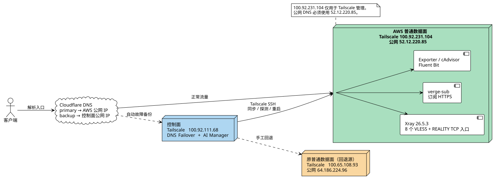

# AWS 普通数据面迁移与回退

本文记录普通 Xray 数据面从当前 DMIT 主机迁移到 AWS 节点的灰度流程。控制面和 AI 数据面不迁移。



[PlantUML 源文件](diagrams/aws-normal-data-plane-migration.puml)

## 节点与职责

| 节点 | Tailscale 地址 | 公网地址 | 角色 |
| --- | --- | --- | --- |
| 原数据面 | `redacted-ip-003` | `redacted-ip-011` | 当前运行节点，保留为回退源 |
| AWS 数据面 | `control-plane-host` | `redacted-ip-010` | 新普通数据面；AWS `us-west-2` |
| 控制面 | `redacted-ip-005` | `redacted-ip-008` | DNS 故障切换、远程同步和 AI 路由管理 |

`control-plane-host` 是 Tailscale 管理地址，公网客户端不能把它作为 DNS A 记录。公网 DNS、探测和订阅生成应使用 AWS 公网地址 `redacted-ip-010`，或使用指向该地址的域名。

## 当前切换状态

2026-09-04 已完成 AWS 普通数据面切换：

- Cloudflare `ai.zrhe2016.cc` 的 A 记录已切换到 `redacted-ip-010`，TTL 保持 `60`，当前目标为 `primary`；
- 控制面已改为通过严格 SSH 主机校验管理 `control-plane-host`，普通节点备份采集已验证成功；
- 原节点历史归档已复制到 AWS `/root/xray-routing-panel/migration-history/source-normal-data-plane-20260904/`，包含 Xray/系统/Docker 日志、运行目录、systemd/网络/Docker/Tailscale 状态和 Node Exporter/cAdvisor 快照；
- AWS 主机 nftables 同步脚本已显式保留订阅 HTTPS `443`，防火墙定时器持续运行；
- 原数据面 `redacted-ip-011` 未停止，仍保留为人工回退源；DNS 自动故障备份仍为控制面 `redacted-ip-008`；
- 切换后的 AWS 端口、REALITY 握手、HTTPS 订阅和 DNS 探测均已验证通过。

源节点没有本地 Prometheus 或 Grafana 时序数据库；Node Exporter、cAdvisor 本身无历史存储，因此已复制其当前指标快照和 Fluent Bit 状态。归档仅用于审计/恢复，不会覆盖 AWS 当前运行配置。

## 已完成的部署与切换

2026-09-04 已在 AWS 节点完成：

- 安装 Docker Engine 与 Compose v2；
- 部署 `deploy/normal-data-plane/docker-compose.node.yml`；
- 从当前运行态复制 Xray 26.5.3 配置，保留 `31098、31333、31335–31340` 共 8 个入口；
- 运行 Xray 配置校验、Tailscale TCP 探测和 `www.amazon.com` SNI REALITY 握手，均通过；
- 部署 `verge-sub` 订阅服务并设为开机自启；
- 部署 Node Exporter、cAdvisor 和 Fluent Bit，控制面可通过 Tailscale 读取监控端点；
- 原数据面和原订阅服务未停止，仍可直接回退。

## AWS 安全组门禁

AWS 实例本地防火墙和绑定安全组已放行并验证以下公网 TCP 端口：

- `443`：订阅 HTTPS；
- `31098、31333、31335、31336、31337、31338、31339、31340`：Xray REALITY 入口。

`19100`、`18081` 只应通过 Tailscale 访问，不要开放到公网。当前 AWS 实例角色无 `ec2:DescribeSecurityGroups` 权限，不能由实例自身修改安全组。

## 切换顺序

1. 从控制面和外部网络确认 AWS 公网端口全部可达，并至少对 `31098`、`31333`、`31340` 做 REALITY 握手。
2. 在控制面 `redacted-ip-005` 的受保护 `.env` 中将普通数据面目标改为：

   ```dotenv
   DATAPLANE_SSH_TARGET=root@control-plane-host
   DATAPLANE_PROBE_HOST=redacted-ip-010
   DATAPLANE_CONFIG_PATH=/root/xray-routing-panel/app/xray/runtime/config.json
   DATAPLANE_PANEL_PORTS_PATH=/root/xray-routing-panel/app/xray/runtime/panel-ports.json
   DATAPLANE_DYNAMIC_ROUTING_PATH=/root/xray-routing-panel/app/xray/runtime/dynamic-routing.json
   DATAPLANE_ACCESS_LOG_PATH=/root/xray-routing-panel/app/xray/logs/access.log
   DB_BACKUP_DATAPLANE_SSH_TARGET=root@control-plane-host
   DNS_FAILOVER_PROBE_HOST=redacted-ip-010
   DNS_FAILOVER_PROBE_PORT=31098
   DNS_FAILOVER_PRIMARY_CONTENT=redacted-ip-010
   ```

   保留 `CONTROL_PLANE_BACKUP_XRAY_ENABLED=1` 和现有控制面备用内容 `redacted-ip-008`。修改前先人工核对目标主机指纹并把它加入控制面对应的 `known_hosts`，不要关闭严格主机校验。

3. 重启控制面面板/AI 域名管理器，使新环境变量生效；确认面板显示 AWS 数据面可达，并确认备份采集可以读取 AWS 节点。
4. 将 Cloudflare 普通入口记录的 primary 内容切换为 `redacted-ip-010`，保持 TTL 为 `60`，观察至少一个完整探测周期。
5. 确认旧节点保持在线、AWS Xray/订阅/监控均健康后，再结束迁移窗口。

## 回退

如果 AWS 节点或其公网连通性异常：

1. 在 Cloudflare 将入口记录切回原数据面公网地址 `redacted-ip-011`；
2. 将控制面以下变量恢复到原值：

   ```dotenv
   DATAPLANE_SSH_TARGET=root@redacted-ip-003
   DATAPLANE_PROBE_HOST=redacted-ip-011
   DB_BACKUP_DATAPLANE_SSH_TARGET=root@redacted-ip-003
   DNS_FAILOVER_PROBE_HOST=redacted-ip-011
   DNS_FAILOVER_PRIMARY_CONTENT=redacted-ip-011
   ```

3. 重启控制面面板/AI 域名管理器并确认 `data_plane`、备份采集和 DNS 探测恢复；
4. 只在流量已经回到原节点后，才停止 AWS 上的 `xray-reality-local` 或 `verge-sub`。

回退是可逆的：不会删除 AWS 目录或配置；修复 AWS 安全组/服务后可重新执行“切换顺序”。
