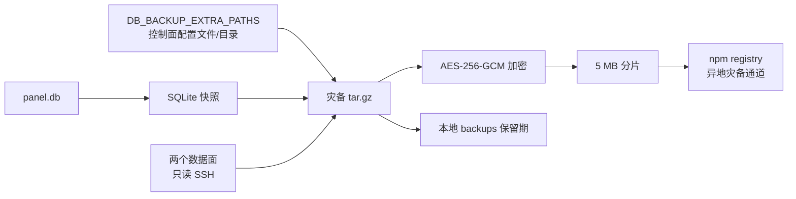
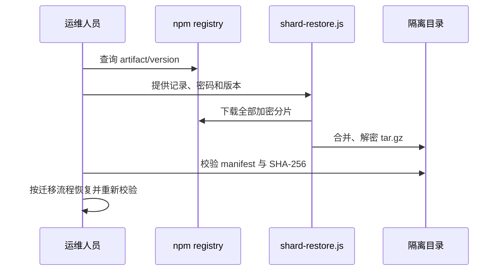

# 灾备归档与 npm 上传通道

本模块只说明“如何生成和保存灾备归档”。它不负责故障切换、在线热备或快速恢复；恢复发生在灾难处理阶段，优先保证归档可取、可验证、可解密。

## 目标与边界

- 每日生成一个本地 SQLite 快照。
- 将数据库快照和配置文件、运行时配置等额外文件打成一个 `tar.gz`。
- 在进入 npm 之前使用现有 `db-backup-uploader` 做 AES-256-GCM 加密和分片。
- npm registry 只作为异地灾备上传通道，默认保留每次发布的不可变版本。
- 不把 npm registry 当作在线恢复源，也不在故障切换路径中调用 npm。

## 归档流程



任务入口是 `scripts/run_db_backup_cycle.py`：

1. 调用 `scripts/backup_db.py`，通过 SQLite 在线备份 API 生成 `backups/<prefix>-<UTC 时间戳>.db`。
2. `DB_BACKUP_SSH_COLLECTION_ENABLED=1` 时，调用 `scripts/collect_remote_backup.py`，以严格只读 SSH 采集普通数据面和 AI 数据面的主配置与可选环境文件。
3. 调用 `scripts/build_backup_bundle.py`，把数据库快照放在 `database/`、控制面额外路径放在 `config/`、远端 staging 放在 `nodes/`，并写入 `backup-manifest.json`。
4. `DB_BACKUP_UPLOADER_ENABLED=1` 时，把归档交给 `components/db-backup-uploader/shard-upload.js`。
5. 上传器执行 AES-256-GCM 加密、切片、发布 npm 包并更新本地 `upload-records.json`。

单次任务的组件边界如下：

```text
backup_db.py              只负责 SQLite 快照
collect_remote_backup.py  只负责 SSH 只读采集和 staging manifest
build_backup_bundle.py    只负责文件收集、归档和校验元数据
shard-upload.js           只负责加密、切片、npm 发布
shard-restore.js          只负责灾难阶段下载、合并和解密
```

## 默认收集内容

Docker Compose 的备份容器默认收集：

- 当次生成的 `panel.db` 一致性快照
- `/srv/xray-ops/ops.db` 的独立 SQLite 在线快照（存在时）
- Compose、ops-reporting Compose、`.env`/`.env.ops-reporting`、Kubernetes 清单
- Xray `.env`、渲染运行配置、备份脚本及 uploader 包定义

项目目录和 `/srv/xray-ops` 均只读挂载到备份容器；缺失的可选文件会记录在 manifest 中，不阻断 `panel.db` 备份。启用 SSH 采集后，归档还会加入：

```text
database/
config/                       # 控制面 DB_BACKUP_EXTRA_PATHS
nodes/
  normal-data-plane/...       # 普通数据面主机实际路径
  ai-data-plane/etc/xray/config.json
  remote-node-collection.json
backup-manifest.json
```

本次实测普通数据面主配置是 `/root/xray-routing-panel/app/xray/runtime/config.json`，AI 数据面主配置是 `/etc/xray/config.json`，AI SSH 端口为 `27160`。可选 `.env` 不存在时不会阻断节点主配置归档；逐文件结果记录在 `nodes/remote-node-collection.json`。完整 SSH 边界、密钥和排障步骤见[远端节点配置采集](remote-node-backup.md)。

Kubernetes 变体默认关闭 SSH 采集，因为清单没有内置生产私钥和 known_hosts。若要启用，必须创建 Secret 并以只读卷挂载 key、两个 known_hosts 文件，再在备份 CronJob 的 ConfigMap/Secret 中显式设置目标和路径；不要把私钥内容提交到仓库。Kubernetes 的具体边界见[K3s 部署](kubernetes.md)。

## 配置

| 变量 | 默认值 | 说明 |
| --- | --- | --- |
| `DB_BACKUP_BUNDLE_ENABLED` | `1` | 是否生成灾备归档；关闭后仍保留单独 `.db` 快照 |
| `DB_BACKUP_EXTRA_PATHS` | Compose 中的显式项目配置 allowlist | 逗号或换行分隔的文件、目录或 glob；不存在的可选路径会记录并跳过 |
| `DB_BACKUP_OPS_DB_PATH` | `/ops-data/ops.db` | 可选运维 SQLite 数据库；使用 SQLite backup API 生成一致性副本后纳入归档 |
| `DB_BACKUP_BUNDLE_DIR` | `DB_BACKUP_DIR` | 灾备归档本地目录 |
| `DB_BACKUP_BUNDLE_KEEP_DAYS` | `DB_BACKUP_KEEP_DAYS` | 本地灾备归档保留天数，`0` 表示不清理 |
| `DB_BACKUP_BUNDLE_PREFIX` | `DB_BACKUP_PREFIX` | 归档名前缀 |
| `DB_BACKUP_SSH_COLLECTION_ENABLED` | Compose 为 `1`，脚本默认 `0` | 是否在打包前通过 SSH 读取两个数据面 |
| `DB_BACKUP_SSH_COLLECTION_REQUIRED` | `0` | `1` 时两个节点都必须连通且主配置成功；`0` 时记录失败但继续保留控制面归档 |
| `DB_BACKUP_SSH_KEY_PATH` | `/run/secrets/fleet_ssh_key` | 只读 SSH 私钥；源文件权限过宽时采集器使用临时 `0600` 副本 |
| `DB_BACKUP_SSH_OPTIONS` | 空 | 仅允许 `-4`/`-6`、日志级别和连接超时/keepalive 等安全选项 |
| `DB_BACKUP_DATAPLANE_REMOTE_PATHS` | 普通数据面实测宿主路径 + `.env` | 逗号/换行分隔；第一个路径是主配置 |
| `DB_BACKUP_AI_NODE_SSH_PORT` | `27160` | AI 数据面 SSH 端口（`nat.qq.pw:27160`） |
| `DB_BACKUP_AI_NODE_REMOTE_PATHS` | `/etc/xray/config.json,/etc/xray/.env` | AI 节点主配置和可选环境文件 |
| `DB_BACKUP_UPLOADER_ENABLED` | `0` | 是否将灾备归档上传到 npm |
| `DB_BACKUP_UPLOADER_PASSWORD` | 空 | AES-256-GCM 密码；必须使用真实随机密码 |
| `DB_BACKUP_UPLOADER_PRUNE_REMOTE` | `0` | 是否删除上一轮 npm 版本；灾备场景保持 `0` |

示例：加入控制面项目文件和自定义密钥目录（目录必须以只读方式挂载到备份容器）：

```dotenv
DB_BACKUP_EXTRA_PATHS=/app/xray/.env,/app/xray/runtime,/backup-input/docker-compose.yml,/backup-input/k8s
```

`DB_BACKUP_EXTRA_PATHS` 路径会被写入归档的 `config/` 前缀下，远端 SSH staging 则写入 `nodes/`，避免恢复时覆盖宿主机绝对路径。归档内的 `backup-manifest.json` 记录每个文件的来源、大小和 SHA-256；远端节点另有 `remote-node-collection.json` 记录 SSH 目标和逐路径状态，便于灾难阶段人工核验。

`DB_BACKUP_EXTRA_PATHS` 可以包含业务敏感配置，但不要把 npm `.npmrc`、SSH 私钥或其他不需要迁移的凭据目录加入列表；数据库快照和灾备归档在本地生成时仍是明文，文件权限统一为 `0600`，备份目录也必须限制为备份服务可读。npm token 只通过挂载的 `.npmrc` 提供，灾备加密密码必须与 npm token 分离保存。任何出现在聊天、日志或 shell 历史中的 token 都应立即撤销。

## npm 灾备保留策略

自动任务会把 `DB_BACKUP_UPLOADER_PRUNE_REMOTE=0` 传递给上传器。上传成功后：

- 每个分片使用带时间戳的不可变 npm 版本；不会覆盖同版本。
- 不执行 `npm unpublish`，历史归档仍可在 registry 中查询。
- 本地 `upload-records.json` 作为最近一次归档和有限历史（由 `DB_BACKUP_UPLOADER_RECORD_HISTORY_LIMIT` 控制）的索引，不是唯一灾备副本。
- npm 认证文件仅从挂载的 `data/db-backup-uploader/.npmrc` 读取，不会写入归档内容。

如果 registry 成本或保留策略发生变化，可以在 registry 侧设置生命周期规则；不要在面板任务中删除版本，以免一次误删同时破坏本地和异地副本。

## 灾难阶段恢复

恢复是人工、低频流程，不纳入健康检查或 DNS 故障切换：

1. 获取 `upload-records.json` 中的 artifact/version，或从 npm registry 找到对应的分片包。
2. 使用原来的 `DB_BACKUP_UPLOADER_PASSWORD` 执行 `shard-restore.js`，先输出到隔离目录。
3. 校验 `backup-manifest.json` 中的 SHA-256，再按迁移文档恢复 `panel.db` 和配置文件。
4. 重新渲染并校验 Xray 配置，确认探针、Prometheus 和服务健康后再切换业务流量。

Compose 默认 artifact 名为 `xray-routing-panel-disaster-backup`，示例命令：

```bash
SHARD_PASSWORD="$DB_BACKUP_UPLOADER_PASSWORD" \
NPM_SCOPE="@your-npm-scope" \
node components/db-backup-uploader/shard-restore.js \
  --artifact xray-routing-panel-disaster-backup \
  --version 20260808.30000.0 \
  --output-dir /var/tmp/xray-disaster-restore
```

`--version` 应替换为需要的 UTC 时间戳版本；恢复结果是归档文件，不会自动覆盖运行中的配置。



## 排查

- 本地 `.db` 有、归档没有：检查 `DB_BACKUP_BUNDLE_ENABLED`、`DB_BACKUP_BUNDLE_DIR` 的权限和备份容器日志。
- 归档有、npm 没有：检查 `DB_BACKUP_UPLOADER_ENABLED`、密码、scope、`.npmrc` 和 npm registry 网络访问。
- npm 版本被删除：检查任务环境是否误设 `DB_BACKUP_UPLOADER_PRUNE_REMOTE=1`，并立即停止自动清理。
- 配置文件缺失：查看归档内 `backup-manifest.json` 的 `skippedExtraPaths`，确认路径已挂载且在任务执行时存在。
