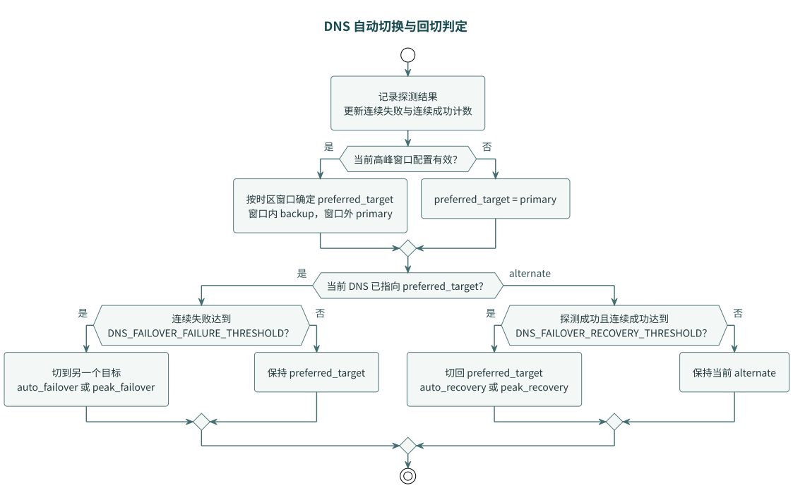
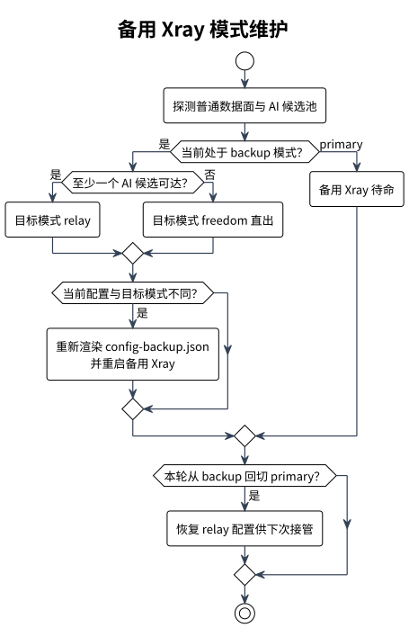

# DNS 故障切换

> Type: Runbook
> Status: Active
> Scope: Cloudflare DNS 切换、恢复阈值、控制面备用 Xray 模式与操作排障

## 设计目标

当普通数据面故障时，控制面通过 Cloudflare API 自动将 DNS 记录切到控制面本机，由控制面备用 Xray 接管流量。控制面备用 Xray 有两种工作模式：

本机制保证的是普通数据面或 AI 节点的单点故障，以及控制面在线时的“普通数据面 + AI 节点”组合故障；控制面和普通数据面同时故障不在当前两节点架构的保证范围内，详见 [fault-tolerance.md](fault-tolerance.md)。

- **relay 模式**（AI 节点正常时）：将所有流量转发到 AI 节点，由 AI 节点 freedom 直出
- **直出模式**（AI 节点也故障时）：控制面备用 Xray 直接 freedom 出站

模式切换由控制面自动完成，无需人工干预。

## 架构拓扑

### 场景① 正常运行


[PlantUML 源文件](diagrams/dns-primary-topology.puml)

DNS 记录指向普通数据面公网 IP，控制面备用处于待命状态。

### 场景② AI 候选故障


[PlantUML 源文件](diagrams/dns-ai-failover-topology.puml)

DNS 记录不变。`auto` 模式下由 `ai_domain_manager` 选择另一可达 AI 候选；全部候选不可达时，AI 域名流量回退到普通数据面直出，不涉及 DNS 切换。

### 场景③ 数据面故障（AI 节点正常）


[PlantUML 源文件](diagrams/dns-backup-relay-topology.puml)

DNS 切到控制面 IP，控制面备用 Xray 以 relay 模式将所有流量转发到 AI 节点。

### 场景④ 双节点故障（数据面 + AI 节点）


[PlantUML 源文件](diagrams/dns-backup-direct-topology.puml)

DNS 切到控制面 IP，控制面探测到 AI 节点不可达，自动将备用 Xray 切换为直出模式。

## 完整配置参数表

### DNS 故障切换核心变量

| 变量 | 默认值 | 必填 | 说明 |
| --- | --- | --- | --- |
| `DNS_FAILOVER_ENABLED` | `0` | 是 | 是否启用 Cloudflare DNS 故障切换 |
| `DNS_FAILOVER_INTERVAL` | `15` | 否 | 后台检测周期（秒）|
| `DNS_FAILOVER_TIMEOUT` | `3` | 否 | 单次协议请求超时（秒）|
| `DNS_FAILOVER_FAILURE_THRESHOLD` | `3` | 否 | 连续失败多少次切到备用 |
| `DNS_FAILOVER_RECOVERY_THRESHOLD` | `2` | 否 | 连续成功多少次回切主数据面 |
| `DNS_FAILOVER_PROBE_HOST` | — | 是 | 主数据面 VLESS + REALITY 探测目标（域名或 IP）|
| `DNS_FAILOVER_PROBE_PORT` | — | 是 | 主数据面 VLESS + REALITY 探测端口 |
| `DNS_FAILOVER_PRIMARY_CONTENT` | — | 远端模式必填 | 主数据面入口 IP 或 CNAME；本地模式留空时自动获取数据面公网 IP |
| `DNS_FAILOVER_BACKUP_CONTENT` | — | 否 | 控制面备用节点 IP 或 CNAME；留空时自动获取控制面本机公网 IP |
| `DNS_FAILOVER_BACKUP_LABEL` | `控制面备用Xray` | 否 | 面板展示用备用节点名称 |

### Cloudflare API 变量

| 变量 | 默认值 | 必填 | 说明 |
| --- | --- | --- | --- |
| `CF_API_TOKEN` | — | 是 | Cloudflare API Token，至少需要目标 Zone 的 DNS 编辑权限 |
| `CF_ZONE_ID` | — | 是 | Cloudflare Zone ID |
| `CF_DNS_RECORD_ID` | — | 是 | 要切换的单条 DNS Record ID |
| `CF_DNS_RECORD_TYPE` | `A` | 否 | 当前支持 `A` / `AAAA` / `CNAME` |
| `CF_DNS_RECORD_NAME` | — | 是 | 记录名，例如 `edge.example.com` |
| `CF_DNS_RECORD_PROXIED` | `0` | 否 | 是否保持 Cloudflare 代理 |
| `CF_DNS_RECORD_TTL` | `60` | 否 | 记录 TTL；非代理记录建议 `60` 以尽快生效 |

### 控制面备用 Xray 变量

| 变量 | 默认值 | 必填 | 说明 |
| --- | --- | --- | --- |
| `CONTROL_PLANE_BACKUP_XRAY_ENABLED` | `0` | 否 | 是否启用"控制面本机公网 IP + 备用 Xray"自动备用模式 |
| `CONTROL_PLANE_BACKUP_UPSTREAM_URL` | — | relay 模式必填 | 完整、受保护的 `vless://` 上游 URL；必须与 AI 节点独立 inbound 凭据完整匹配 |

### 高峰窗口变量

| 变量 | 默认值 | 必填 | 说明 |
| --- | --- | --- | --- |
| `DNS_FAILOVER_PEAK_ENABLED` | `0` | 否 | 是否启用"高峰窗口优先专用节点" |
| `DNS_FAILOVER_PEAK_START` | — | 否 | 高峰窗口起始时间，格式 `HH:MM` |
| `DNS_FAILOVER_PEAK_END` | — | 否 | 高峰窗口结束时间，格式 `HH:MM` |
| `DNS_FAILOVER_PEAK_TIMEZONE` | 留空 | 否 | 高峰窗口时区；留空采用[面板默认时区](configuration.md)，可显式设置 IANA 时区名或 UTC 偏移 |

## 工作机制

### 探测逻辑

控制面独立 DNS failover worker 周期性经专用执行主机运行主诊断客户端，对 `DNS_FAILOVER_PROBE_HOST:DNS_FAILOVER_PROBE_PORT` 做认证 VLESS + REALITY 请求。主机与凭据错误不会改变连续失败/成功计数或 DNS 目标；实际协议请求失败才参与阈值判定。该 worker 不依赖数据面日志、流量、API 或配置同步，主数据面失联时仍可执行切换。执行与凭据约束见[协议探测运维](operations.md#协议探测)。

### 自动切换与回切



[PlantUML 源文件](diagrams/dns-failover-decision.puml)

切换由 `app/state/dns_failover.py` 的 `evaluate_dns_failover_transition()` 决定，`switch_dns_target()` 执行 Cloudflare API 调用。

### 高峰窗口

启用 `DNS_FAILOVER_PEAK_ENABLED=1` 后，在指定时区的时间窗口内：

- 窗口内：把 backup 作为首选目标（窗口内优先使用备用/专用节点）
- 窗口外：把 primary 作为首选目标

窗口判定逻辑见 `peak_window_active()`（`state/dns_failover.py:53`）。

### primary / backup IP 自动获取

`resolve_dns_failover_contents()`（`state/dns_failover.py:239`）负责解析 primary 和 backup 的 IP：

- 本地数据面且 `DNS_FAILOVER_PRIMARY_CONTENT` 留空 → 调用 `data_plane.resolve_public_ip()` 获取数据面公网 IP
- 远端数据面必须显式设置 `DNS_FAILOVER_PRIMARY_CONTENT`；DNS worker 不会通过 SSH 查询失联的数据面
- `DNS_FAILOVER_BACKUP_CONTENT` 留空 + `CONTROL_PLANE_BACKUP_XRAY_ENABLED=1` → 调用 `resolve_public_ip()` 获取控制面本机公网 IP
- `DNS_FAILOVER_BACKUP_CONTENT` 留空 + `CONTROL_PLANE_BACKUP_XRAY_ENABLED=0` → 报错，必须显式填写

## 控制面备用 Xray 双模式

### relay 模式（AI 节点正常）

控制面备用 Xray 的 `config-backup.json` 包含一个 relay outbound，将所有客户端连接转发到 AI 节点：

```json
{
  "tag": "direct",
  "protocol": "vless",
  "settings": {
    "vnext": [
      {
        "address": "<AI节点公网IP>",
        "port": <AI_UPSTREAM_PORT>,
        "users": [{"id": "<UUID>", "encryption": "none", "flow": "xtls-rprx-vision"}]
      }
    ]
  },
  "streamSettings": {
    "network": "tcp",
    "security": "reality",
    "realitySettings": {
      "serverName": "<XRAY_SERVER_NAME>",
      "fingerprint": "<XRAY_FINGERPRINT>",
      "publicKey": "<XRAY_REALITY_PUBLIC_KEY>",
      "shortId": "<XRAY_REALITY_SHORT_ID>"
    }
  }
}
```

relay outbound 由 `build_backup_relay_outbound()`（`app/xray/render_config.py:179`）从 `CONTROL_PLANE_BACKUP_UPSTREAM_URL` 构建。

### 直出模式（AI 节点故障）

当控制面探测到 AI 节点不可达时，自动重新渲染 `config-backup.json`，将 relay outbound 替换为 freedom 直出：

```json
{
  "tag": "direct",
  "protocol": "freedom"
}
```

然后重启控制面备用 Xray 容器。

### 自动模式切换

目标态下，DNS failover worker 的每次检测中增加 AI 节点可达性探测：



[PlantUML 源文件](diagrams/dns-backup-mode.puml)

### `CONTROL_PLANE_BACKUP_UPSTREAM_URL` 凭据边界

AI 节点使用独立 REALITY 凭据时，不能从普通数据面 `XRAY_*` 自动派生 relay URL。配置 `AI_NODE_SSH_TARGET` 只证明控制面可以纳管节点，不证明 UUID、公钥、Short ID、SNI 等隧道字段匹配。

启用 relay 模式前必须：

1. 从受保护的配置源提供完整 `CONTROL_PLANE_BACKUP_UPSTREAM_URL`；
2. 确认其字段与 AI 节点 inbound 完整匹配；
3. 不在日志、文档或命令输出中显示 URL；
4. 无法提供独立 AI 凭据时保持 relay 能力关闭，使用备用直出模式。

字段契约和安全比较方法见 [AI 节点独立凭据](ai-node-credentials.md)。

### Docker Compose 用法

```bash
# 启用控制面备用 Xray
# 1. 在根 .env 中设置
CONTROL_PLANE_BACKUP_XRAY_ENABLED=1

# 2. 启动备用 Xray 容器
docker compose --profile backup-xray up -d xray-reality-backup

# 3. 查看日志
docker compose --profile backup-xray logs -f xray-reality-backup
```

> 控制面备用 Xray 和普通数据面如果绑定同一端口，不能在同一台机器上同时运行。控制面备用仅在 DNS 切到 backup 时实际承载流量。

## 故障场景矩阵

| 场景 | 普通数据面 | AI 候选池 | 控制面备用 | DNS 指向 | 流量路径 | 触发方式 |
| --- | --- | --- | --- | --- | --- | --- |
 | ① 正常 | ✅ 运行中 | ✅ 运行中 | ⏸ 待命 | primary（数据面 IP）| 客户端→数据面→直出；AI→数据面→AI节点→直出 | — |
 | ② 单个 AI 候选故障 | ✅ 运行中 | ⚠ 主或备故障 | ⏸ 待命 | primary（不变）| 客户端→数据面→另一 AI 候选（auto）| `ai_domain_manager` 自动选择 |
 | ③ 主、备 AI 候选同时故障 | ✅ 运行中 | ❌ 全部不可达 | ⏸ 待命 | primary（不变）| 客户端→数据面→直出（AI 流量回退 freedom）| `ai_domain_manager` 自动回退 |
 | ④ 数据面故障 | ❌ 故障 | ✅ 至少一候选可达 | 🔵 接管（relay）| backup（控制面 IP）| 客户端→控制面备用→relay→AI节点→直出 | DNS 自动切换 |
 | ⑤ 双节点故障 | ❌ 故障 | ❌ 全部不可达 | 🔵 接管（直出）| backup（控制面 IP）| 客户端→控制面备用→freedom 直出 | DNS 自动切换 + 备用模式自动切换 |

### 各场景详细说明

#### 场景① 正常运行

- DNS 指向普通数据面 IP
- 客户端连接数据面，普通流量 freedom 直出
- AI 域名流量通过 `dynamic-routing.json` 转发到 AI 节点，AI 节点 freedom 直出
- 控制面备用处于待命状态，`config-backup.json` 预渲染为 relay 模式

#### 场景② AI 候选故障

- DNS 指向不变（仍为 primary / 数据面 IP）
- `app/xray/ai_routing/selector.py` 的 `select_ai_target()` 探测主、备候选
- `auto` 模式下选择另一可达候选并更新 `dynamic-routing.json`
- 如果两个候选都不可达，才删除 `dynamic-routing.json`，重新渲染数据面配置并回退到 freedom 直出
- 候选恢复后，下一轮探测重新生成 `dynamic-routing.json`，恢复转发

**此场景完全由 `ai_domain_manager` 处理，不涉及 DNS 切换。人工 `primary` / `backup` 模式下，固定目标不可达会报告 `manual_target_unreachable`，不会自动改选另一候选。**

#### 场景③ 数据面故障

- DNS failover 探测到 `DNS_FAILOVER_PROBE_HOST:PORT` 连续失败达到阈值
- DNS 记录切到控制面 IP（backup）
- 控制面备用 Xray 以 relay 模式运行，将所有流量转发到 AI 节点
- 当前可达 AI 候选接收流量后 freedom 直出
- 控制面同时探测 AI 候选池，确认至少一个候选可用于 relay
- 数据面恢复后，连续成功达到阈值，DNS 自动回切 primary

#### 场景⑤ 双节点故障

- DNS failover 探测到数据面故障，DNS 切到控制面 IP（backup）
- 控制面探测 AI 候选池全部不可达
- 自动重新渲染 `config-backup.json` 为 freedom 直出模式
- 重启控制面备用 Xray
- 所有流量从控制面备用直接出去
- 任一 AI 候选恢复后，自动切回 relay 模式（重新渲染 + 重启）

### 场景④→⑤ 和 ⑤→④ 的自动切换

备用入口活跃时，每轮根据 AI 候选池可达性维护 relay 或直出配置；模式改变才重新渲染并重启。判定流程见[备用 Xray 模式维护](#自动模式切换)。

## 面板节点状态展示

目标态下，管理后台首页概览区新增「节点状态」卡片，以流程图形式展示三节点状态和当前流量导向。

### 节点状态卡片

| 节点 | 正常状态 |
| --- | --- |
| 普通数据面 | 运行中，承载主入口流量 |
| AI 节点 | 运行中，承载命中 AI 规则的流量 |
| 控制面备用 | 待命 |

正常流量路径见[正常运行拓扑](#场景①-正常运行)。

故障场景③：

流量路径见[备用 relay 拓扑](#场景③-数据面故障ai-节点正常)。

故障场景④：

流量路径见[备用直出拓扑](#场景④-双节点故障数据面--ai-节点)。

### 后台路由快照

后台图示和交互见[管理后台与流量拓扑](development.md#前端开发)。`/api/dashboard` 的
`meta.traffic_routing` 描述域名分流配置及其应用证据；节点管理健康不等于端到端流量健康。
`scenario` 是说明文本，`path` 才是路径枚举。

```json
{
  "path": "normal_ai",
  "label": "普通直出 + AI→AI 主节点",
  "scenario": "普通及未分类域名直出；已分类 AI 域名转发到所选上游。",
  "route_status": "已应用分流",
  "is_degraded": false,
  "waiting_for_switch": false,
  "entry_node": "普通数据面",
  "transit_nodes": ["AI 主节点"],
  "exit_node": "普通直出 / AI 主节点出口",
  "ordinary_direct_state": "active",
  "ai_branch_state": "active",
  "traffic_scope": "split_domains"
}
```

`path` 取值与含义：

| 路径 | 配置含义 |
| --- | --- |
| `normal_ai` | 报告确认应用 AI 分流，普通直出仍保留；探测失败可使 AI 分支显示 blocked |
| `normal_ai_pending` | 默认普通直出保留，AI 报告、应用或选中候选证据尚未确认 |
| `normal_direct` | 已确认不启用 AI 分流，全部域名使用普通直出 |
| `normal_fallback` | 报告确认 AI 分流已回退到普通直出 |
| `dns_backup_relay_ai` | DNS 记录指向备用，实际备用配置将全部域名中继；不要求中继目标是当前 AI 候选 |
| `dns_backup_direct` | DNS 记录指向备用，实际备用配置将全部域名直出 |
| `dns_backup_unknown` | DNS 记录指向备用，但实际备用出口尚未确认 |
| `dns_backup_pending` | 主入口状态尚未确认，DNS 记录仍指向主入口 |
| `unknown` | 入口或配置证据不足 |

分支状态取值为 `active`、`standby`、`blocked`、`unknown`；`active` 描述图中有证据的配置路径，
不表示观测到实时字节或流量占比。`traffic_scope` 为普通数据面的 `split_domains` 或备用入口的
`all_traffic`，协议阻断规则仍优先执行。

`meta.ai_routing_status.report_generated_at` 保留带时区的原始报告时间；
`config_apply_status` 保留 `direct`、`unchanged`、`delegated`、`unmanaged`、`not_needed`，缺失或非法值为
`unknown`。只有已确认应用的报告及明确业务探测能标记 AI 分支；外部 watcher 接管本身不等于应用完成。

`meta.dns_failover_status.backup_xray_mode` 从实际渲染的备用默认出口读取 `relay`、`direct`、`disabled`
或 `unknown`；供运维维护使用的期望模式判断保持独立。`backup_relay_target` 只返回经校验的
`upstream_host` 和 `upstream_port`，无法读取、非中继或不合法时为 `null`，不暴露用户或连接凭据。
DNS 目标来自控制面记录，客户端缓存、长连接及配置重载状态仍可能使实际路径暂时不同。

## API 接口

### 获取 DNS 故障切换状态

```bash
curl -u admin:secret http://redacted-ip-007:18080/api/dns-failover
```

返回体包含 `enabled`、`configured`、`current_target`、`current_target_label`、`record_content`、`primary_content`、`backup_content`、`last_probe_status` 等字段。

### 立即执行一次 DNS 检测

```bash
curl -u admin:secret -X POST http://redacted-ip-007:18080/api/dns-failover/check
```

返回最新的 `dns_failover_status`。

### 手动切主备

```bash
# 切到主数据面
curl -u admin:secret -X POST http://redacted-ip-007:18080/api/dns-failover/switch \
  -H 'Content-Type: application/json' \
  -d '{"target": "primary"}'

# 切到控制面备用
curl -u admin:secret -X POST http://redacted-ip-007:18080/api/dns-failover/switch \
  -H 'Content-Type: application/json' \
  -d '{"target": "backup"}'
```

返回最新的 `dns_failover_status`。

## 前端操作

管理后台首页「DNS 故障切换」卡片提供：

- 当前 DNS 指向（primary / backup 标签）
- 记录值（当前 DNS 记录的实际 IP）
- 最近探测结果（成功 / 失败 / 未检测）
- 连续失败 / 成功计数
- 高峰窗口状态（如已启用）
- 操作按钮：立即检测、切到主、切到备

首页总览的「三节点流量切换拓扑」也提供 DNS 主备操作。成功切换或后台轮询发现路径变化后，拓扑链路播放一次性流动动画；浏览器启用减少动态效果时不播放位移动画。

### AI 人工回退

AI 节点不参与 DNS 切换。需要立即固定 AI 流量目标时，可调用以下接口。`primary` 和 `backup` 分别固定主、备候选；固定目标不可达时不会自动改选另一节点。

```bash
# 固定主 AI
curl -u admin:secret http://redacted-ip-007:18080/api/ai-routing/switch \
  -H 'Content-Type: application/json' \
  -X POST \
  -d '{"mode":"primary"}'

# 固定备用 AI
curl -u admin:secret http://redacted-ip-007:18080/api/ai-routing/switch \
  -H 'Content-Type: application/json' \
  -X POST \
  -d '{"mode":"backup"}'
```

如果需要立即停止所有 AI 动态转发并让 AI 域名回到数据面直出：

```bash
curl -u admin:secret http://redacted-ip-007:18080/api/ai-routing/switch \
  -H 'Content-Type: application/json' \
  -X POST \
  -d '{"mode":"forced_fallback"}'
```

控制面会删除动态 AI 路由并在可用时重启数据面；`forced_fallback` 状态会持久化。恢复自动：

```bash
curl -u admin:secret http://redacted-ip-007:18080/api/ai-routing/switch \
  -H 'Content-Type: application/json' \
  -X POST \
  -d '{"mode":"auto"}'
```

恢复自动只清除人工覆盖，不立即运行 AI 管理器；下一轮管理器探测成功后才重新应用 AI 动态路由。

## 排障

### 自动切换没有发生

检查：

- `DNS_FAILOVER_ENABLED` 是否为 `1`
- `DNS_FAILOVER_PROBE_HOST` / `DNS_FAILOVER_PROBE_PORT` 是否指向数据面公网入口（不是控制面地址）
- `CF_API_TOKEN` 是否有目标 Zone 的 DNS 编辑权限
- `CF_ZONE_ID` / `CF_DNS_RECORD_ID` / `CF_DNS_RECORD_NAME` 是否正确
- 首页先确认"最近探测"与"当前 DNS 指向"是否一致

### 备用节点未启动

```bash
# 检查控制面备用 Xray 容器
docker compose --profile backup-xray ps

# 启动
docker compose --profile backup-xray up -d xray-reality-backup

# 确认 CONTROL_PLANE_BACKUP_XRAY_ENABLED=1
```

### relay 模式切换失败

```bash
# 检查 config-backup.json 是否正确渲染
cat app/xray/runtime/config-backup.json | python3 -m json.tool

# 检查 AI 节点可达性
nc -zv <ai-node-ip> <AI_UPSTREAM_PORT>

# 查看控制面日志
docker compose logs -f xray-routing-panel | grep -i "backup\|relay"
```

### DNS 记录值未更新

- 检查 `CF_DNS_RECORD_TTL` 是否过长（建议 `60`）
- 非代理记录（`CF_DNS_RECORD_PROXIED=0`）TTL 生效更快
- Cloudflare API 可能有缓存，等待 1-2 分钟

### 切到 backup 后流量不通

- 确认控制面备用 Xray 容器在运行
- 确认 `config-backup.json` 模式正确（relay 或直出）
- relay 模式下确认 AI 节点可达
- 确认控制面公网 IP 防火墙放行了客户端连接端口

### 高峰窗口不生效

- 确认 `DNS_FAILOVER_PEAK_ENABLED=1`
- 确认 `DNS_FAILOVER_PEAK_START` / `DNS_FAILOVER_PEAK_END` 格式为 `HH:MM`
- 确认 `DNS_FAILOVER_PEAK_TIMEZONE` 设置正确（如 `Asia/Shanghai`）
- 首页"高峰专用节点"卡片会显示当前窗口状态和下次切换时间
