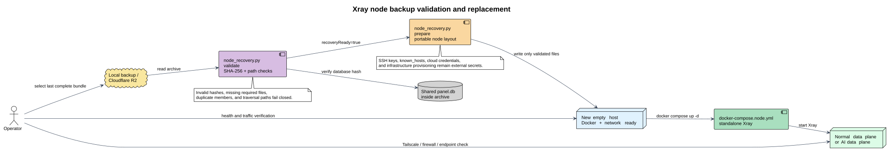

# 节点备份完整性与快速恢复

本模块把灾备归档变成可验证的节点恢复包。当前支持两类可替换节点：普通数据面和 AI 数据面。恢复准备只在新主机本地写入文件，不会通过 SSH 修改旧节点。



[PlantUML 源文件](diagrams/node-recovery-flow.puml)

## 备份覆盖范围

每个新的 `*-disaster-*.tar.gz` 都包含：

| 范围 | 必需内容 | 可选内容 |
| --- | --- | --- |
| 共享控制面状态 | 一致性 `panel.db` 快照、节点恢复清单 | `ops.db`、`data/uploads`、报告和运行时文件 |
| 普通数据面 | 远端实际 `config.json`、远端 `.env` | `panel-ports.json`、`dynamic-routing.json`、客户端测试产物、最新 AI 报告 |
| AI 数据面 | 远端模式：远端 `config.json` + `.env`；本机 Docker 模式：控制面 `config-ai-node.json` + `.env` | — |

完整节点模式通过宿主机 Tailscale SSH 严格只读采集普通数据面，AI 节点有远端目标时同样采集；Compose 默认关闭远端采集，本机 Docker AI 节点直接读取控制面运行时目录。Tailscale 身份、部署 Secret 和 R2 密钥不进入归档，必须放在独立的 Secret 管理位置。

默认远端路径如下；部署目录不同时必须显式设置 `DB_BACKUP_DATAPLANE_REMOTE_PATHS`：

```text
/root/xray-routing-panel/app/xray/runtime/config.json
/root/xray-routing-panel/app/xray/.env
/root/xray-routing-panel/app/xray/runtime/panel-ports.json
/root/xray-routing-panel/app/xray/runtime/dynamic-routing.json
/root/xray-routing-panel/app/xray/runtime/client-test.json
/root/xray-routing-panel/app/xray/runtime/client-share.txt
/root/xray-routing-panel/app/xray/reports/hourly-domains/latest.json
```

`config.json` 和 `.env` 是节点恢复的必需文件；其余路径缺失不会掩盖必需文件缺失，而会在清单中标记为可选缺失。

## 完整性状态

归档根部的两个清单职责不同：

- `backup-manifest.json`：覆盖归档内每个文件的大小和 SHA-256。
- `node-recovery-manifest.json`：按节点列出来源、目标恢复路径、必需/可选文件和 `recoveryReady`。

备份任务完成后会在本地写出 `node-recovery-status.json`。`recoveryReady=true` 的含义是：共享 `panel.db` 存在，且当前已配置节点的必需配置和 `.env` 都已采集并通过哈希校验。

节点暂时失联时，默认阻止该不完整归档继续上传，但状态会明确显示缺失原因；可用最近一个 `recoveryReady=true` 的归档恢复。若计划中的节点维护需要保留控制面-only 归档，可显式关闭门禁：

```dotenv
DB_BACKUP_RECOVERY_REQUIRED=0
DB_BACKUP_SSH_COLLECTION_REQUIRED=0
```

Compose 和直接 cron 默认值均为 `0`，用于允许控制面-only 归档；启用完整节点模式时必须将两个变量都设为 `1`，生成归档并校验后会阻止不完整版本继续上传。节点失联时不要删除此前完整归档。

## 校验归档

在控制面或隔离恢复机上执行，不会写入新节点：

```bash
python3 scripts/node_recovery.py validate \
  --bundle /backups/xray-routing-panel-disaster-20260829T030000Z.tar.gz \
  --require-ready \
  --json
```

命令会重新读取归档内文件，校验 `size` 和 SHA-256，并检查节点恢复清单引用的每个文件。任何篡改、缺失或路径穿越都会直接失败。

## 完整灾备包恢复脚本

如果需要同时准备控制面、数据库、用户附件和两个节点的配置，使用
`scripts/restore_backup.py`。它支持本地明文 `tar.gz` 和从 R2 下载的加密
`.enc` 文件；加密密码只能通过受保护的密码文件或环境变量提供，不要写进命令
行参数。脚本先完成归档和两层 manifest 校验，再开始写入输出目录。

只校验归档：

```bash
python3 scripts/restore_backup.py validate \
  --bundle /backups/xray-routing-panel-disaster-20260829T030000Z.tar.gz \
  --require-ready
```

校验并准备隔离恢复树：

```bash
python3 scripts/restore_backup.py prepare \
  --bundle /backups/xray-routing-panel-disaster-20260829T030000Z.tar.gz \
  --output-dir /tmp/xray-panel-restore
```

加密归档示例：

```bash
python3 scripts/restore_backup.py prepare \
  --bundle /backups/xray-routing-panel-disaster-20260829T030000Z.tar.gz.enc \
  --password-file /run/secrets/xray_restore_password \
  --output-dir /tmp/xray-panel-restore
```

准备目录的布局为：

```text
data/panel.db                 # 必需的面板数据库
data/xray-ops/ops.db          # 归档中存在时恢复
data/uploads/                 # 业务附件
.env                          # 控制面配置
app/xray/                     # 控制面 Xray 配置和运行产物
nodes/normal-data-plane/      # 普通数据面配置，独立目录
nodes/ai-data-plane/          # 单个兼容旧配置的 AI 数据面
nodes/ai-data-plane-<node-id>/ # 多个远端 AI 节点按 node-id 分目录
recovery/                     # 两层 manifest
restore-report.json           # 非敏感恢复结果和完整性状态
```

默认要求共享数据库和所有已配置节点的必需文件都完整；当前节点材料不完整时，
命令会在写入前失败。只有明确要做部分恢复时才使用 `--allow-incomplete`。已有
非空输出目录默认拒绝，`--force` 只允许替换目标文件，不会删除旧文件。
所有文件会先写入输出目录旁的临时恢复树，完整报告生成后才发布；准备失败会清理
临时树，`--force` 更新已有目录时也会在写入异常后回滚已替换文件。

该脚本不会执行 SSH、Docker、数据库在线替换、服务重启、DNS 切换或流量切换。
准备完成后仍需人工检查 `restore-report.json`，停止目标服务，按部署环境恢复
Secret、SSH/known_hosts、防火墙和网络，再进行数据库替换、配置测试、节点健康检查
和业务验收。

## 新建节点并恢复

新主机只需要先准备 Docker、网络/防火墙和 Xray 镜像拉取能力。恢复普通数据面：

```bash
python3 scripts/node_recovery.py prepare \
  --bundle /backups/xray-routing-panel-disaster-20260829T030000Z.tar.gz \
  --node normal-data-plane \
  --output-dir /root/xray-routing-panel

cd /root/xray-routing-panel
docker compose -f docker-compose.node.yml up -d
docker compose -f docker-compose.node.yml ps
```

恢复 AI 数据面使用清单中对应的 `--node` 值（单节点通常是 `ai-data-plane`，多节点是 `ai-data-plane-<node-id>`）和一个新的空目录。`prepare` 会生成标准目录、权限为 `0600` 的配置/`.env`、独立的 `docker-compose.node.yml` 和 `node-recovery.json`；默认拒绝向非空目录写入。只有明确确认目标内容后才使用 `--force`。

恢复完成后按顺序执行：

1. 用 `docker compose -f docker-compose.node.yml logs` 和 Xray 配置测试确认服务健康。
2. Tailscale 模式下，将新主机加入 Tailscale，确认目标主机启用 Tailscale SSH 且 ACL 允许控制面身份以目标用户登录；此模式不需要额外启用 OpenSSH 密码认证或配置 known_hosts。若使用 OpenSSH 兼容模式，则按 `remote-node-backup.md` 恢复受控的 OpenSSH/known_hosts 配置。
3. 在控制面更新对应的 `DATAPLANE_SSH_TARGET` 或 `AI_NODE_SSH_TARGET`、远端配置路径和探测地址；AI 节点还要确认公网地址/端口与 `AI_UPSTREAM_*` 一致。
4. 先做配置同步/探针/业务连接验证，再切换 DNS 或恢复流量。

归档不携带 SSH 私钥、主机密钥、云主机创建凭据和防火墙规则，因此这些基础设施步骤不能由恢复命令静默代替。节点恢复命令只负责把经过校验的业务配置快速落盘并启动 Xray。

## 生产验收

至少每个保留周期执行一次完整演练：

```bash
python3 scripts/node_recovery.py validate --bundle <bundle> --require-ready
python3 scripts/node_recovery.py prepare --bundle <bundle> --node normal-data-plane --output-dir /tmp/xray-node-restore
docker compose -f /tmp/xray-node-restore/docker-compose.node.yml config
```

演练结束后删除隔离目录；不要把包含 `.env` 的恢复目录提交 Git 或复制到公开位置。
