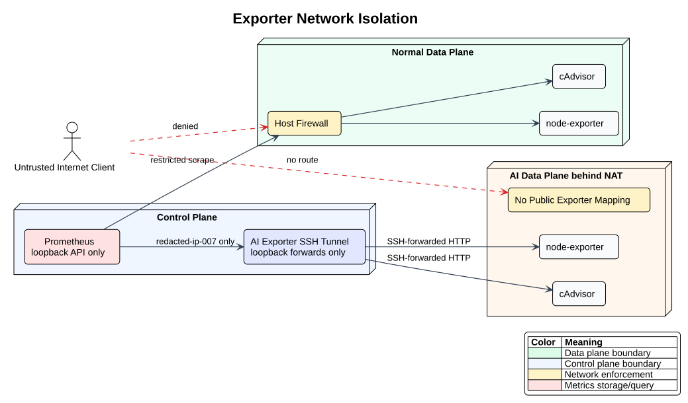

# Exporter 部署与网络隔离

> 权威范围：数据面 exporter 的安装、权限和防火墙

## 部署原则

普通数据面和 AI 数据面只安装 exporter，不安装日报器、SQLite、日志采集器或模型运行时。优先使用发行版包或固定摘要的官方镜像，并记录版本、校验值和升级负责人。

建议最小集合：

- `node_exporter`：CPU、内存、文件系统和主机网络；
- blackbox exporter：部署在独立探测位置，而不是被探测节点；
- Xray 专用 exporter：仅在确有稳定指标接口时部署，禁止通过读取原始日志伪造 exporter。

exporter 使用非 root 专用账号、只读文件系统和最小 capability。不得挂载 SSH 私钥、面板数据库、Xray 配置目录或原始日志目录。

## 监听与防火墙

exporter 优先监听管理网地址。没有管理网时，防火墙只允许 Prometheus 主机 IP 到指标端口，并显式拒绝其他来源；不得使用 `0.0.0.0/0` 放行。



[查看 PlantUML 源文件](diagrams/exporter-network-isolation.puml)

验收时从 Prometheus 主机确认可抓取，再从非授权主机确认连接被拒绝。云安全组与主机防火墙必须同时检查；如果经过反向代理，应启用 TLS/认证且仍限制来源。

## AI 数据面 NAT 部署

AI 数据面没有可直达的 exporter 公网端口。控制面使用 `xray-ai-exporter-tunnel.service` 通过既有管理 SSH 连接转发指标：

```text
Prometheus → 127.0.0.1:19101 → AI node-exporter:9100
Prometheus → 127.0.0.1:18082 → AI cAdvisor:8080
```

本地转发端口只能绑定 `127.0.0.1`，SSH 必须启用严格主机密钥校验、连接失败退出、keepalive 和自动重启。Prometheus 使用 host 网络读取回环端口，但自身仍只监听 `127.0.0.1:9090`。不得为了监控向公网新增 AI exporter NAT 映射，也不得修改 AI Xray 业务端口。

隧道只转发 exporter HTTP。日报器不持有 SSH 凭据，也不通过该隧道执行命令；SSH 凭据仅由控制面的 systemd 隧道服务读取。

## 变更记录

每个 target 记录节点角色、监听地址、端口、exporter 版本、防火墙规则编号和回滚包版本。不得在文档或仓库中记录生产凭据。
