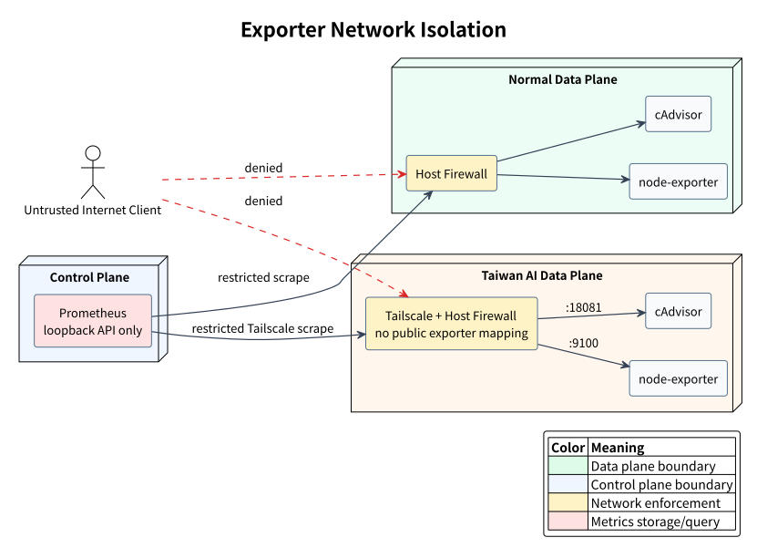

# Exporter 部署与网络隔离

> Type: Runbook
> Status: Active
> Scope: Exporter 部署与网络隔离

## 部署原则

普通数据面和 AI 数据面只安装 exporter，不安装日报器、SQLite、日志采集器或模型运行时。优先使用发行版包或固定摘要的官方镜像，并记录版本、校验值和升级负责人。

建议最小集合：

- `node_exporter`：CPU、内存、文件系统和主机网络；
- blackbox exporter：部署在独立探测位置，而不是被探测节点；
- Xray 专用 exporter：仅在确有稳定指标接口时部署，禁止通过读取原始日志伪造 exporter。

exporter 使用非 root 专用账号、只读文件系统和最小 capability。不得挂载 SSH 私钥、面板数据库、Xray 配置目录或原始日志目录。

## 监听与防火墙

exporter 优先监听管理网地址。没有管理网时，防火墙只允许 Prometheus 主机 IP 到指标端口，并显式拒绝其他来源；不得使用 `redacted-ip-001/0` 放行。

[查看 PlantUML 源文件](diagrams/exporter-network-isolation.puml)

验收时从 Prometheus 主机确认可抓取，再从非授权主机确认连接被拒绝。云安全组与主机防火墙必须同时检查；如果经过反向代理，应启用 TLS/认证且仍限制来源。

## 当前抓取链路

仓库的 [Prometheus 配置](../../monitoring/prometheus/prometheus.yml) 通过 Tailscale 直接抓取普通数据面和台湾 AI 节点；当前 target 与 labels 见[目标配置](prometheus-targets.md#当前配置-targets)。网络隔离图展示此链路，实际上线仍须执行来源限制和可达性验收。

## 历史 AI 数据面 NAT 隧道方案

早期 AI 数据面没有可直达的 exporter 公网端口，控制面使用 `xray-ai-exporter-tunnel.service` 通过管理 SSH 转发指标。以下保留该方案的端口与隔离要求，当前仓库抓取链路不使用这些回环转发端口：

| Prometheus 回环入口 | AI 节点目标 |
| --- | --- |
| `127.0.0.1:19101` | node-exporter `:9100` |
| `127.0.0.1:18082` | cAdvisor `:8080` |

使用历史隧道方案时，本地转发端口只能绑定 `127.0.0.1`，SSH 必须启用严格主机密钥校验、连接失败退出、keepalive 和自动重启。Prometheus 使用 host 网络读取回环端口，自身 API 也仅绑定回环地址。不得为了监控向公网新增 AI exporter NAT 映射，也不得修改 AI Xray 业务端口。

隧道只转发 exporter HTTP。日报器不持有 SSH 凭据，也不通过该隧道执行命令；SSH 凭据仅由控制面的 systemd 隧道服务读取。

## 变更记录

每个 target 记录节点角色、监听地址、端口、exporter 版本、防火墙规则编号和回滚包版本。不得在文档或仓库中记录生产凭据。
