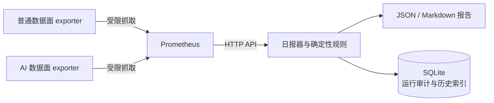

# Prometheus-only 节点运维分析

> 状态：方案文档已更新，部署与生产验收待执行
> 权威范围：本专题边界与模块导航
> 最后核验日期：2026-07-31

本专题只使用 Prometheus 时序指标生成普通数据面与 AI 数据面的运维结论和日报。

## 强制边界

- 不通过 SSH 登录节点，不远程执行命令。
- 不读取、复制、解析或保存 Xray、systemd、Docker 等原始日志。
- 节点只部署指标 exporter；控制面通过 Prometheus HTTP API 查询聚合后的指标。
- exporter 端口只允许 Prometheus 抓取源访问，不向公网开放。
- SQLite 不保存遥测、日志或规则证据，只保留报告运行审计与历史报告归档索引。
- 规则只能判断指标能够证明的运行、可达性、流量连续性和资源风险，不能推断日志级根因。

## 模块导航

| 模块 | 文档 |
| --- | --- |
| exporter 安装、最小权限和防火墙 | [exporter-deployment.md](exporter-deployment.md) |
| Prometheus targets、labels 与查询约束 | [prometheus-targets.md](prometheus-targets.md) |
| 确定性规则能力与边界 | [fault-classification.md](fault-classification.md) |
| 日报生成与报告契约 | [daily-reporter.md](daily-reporter.md)、[report-contract.md](report-contract.md) |
| SQLite 审计与历史归档 | [report-run-audit.md](report-run-audit.md) |
| 灰度、验收和回滚 | [rollout.md](rollout.md)、[acceptance.md](acceptance.md) |
| 日常排障 | [troubleshooting.md](troubleshooting.md) |

旧版 SSH 日志采集器、原始日志入库和日志解析流程不属于本方案，不应部署或作为回退路径保留。
