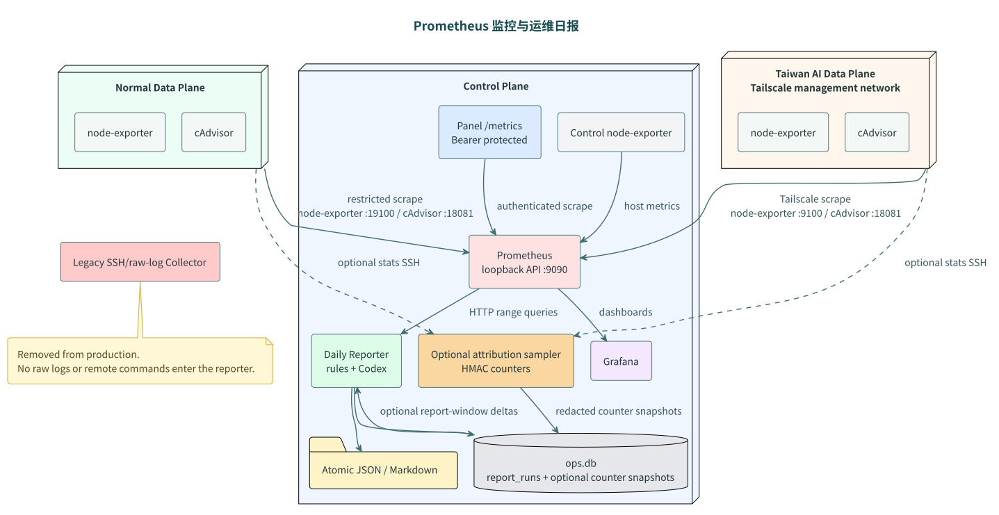

# Prometheus 与脱敏归因节点运维分析

> Type: Architecture
> Status: Active
> Scope: 运维分析模块职责、数据来源、隔离边界与历史部署记录

本专题使用 Prometheus 时序指标生成普通数据面与 AI 数据面的运维结论和日报，并可用脱敏 Xray counter 快照补充 user/inbound 流量归因。

## 强制边界

- Reporter 不通过 SSH 登录节点，不远程执行命令；可选归因采样器只执行固定 stats 读取命令。
- 不读取、复制、解析或保存 Xray、systemd、Docker 等原始日志。
- 节点只部署指标 exporter；控制面通过 Prometheus HTTP API 查询聚合后的指标。
- exporter 端口只允许 Prometheus 抓取源访问，不向公网开放。
- SQLite 不保存原始日志或规则证据；归因采样只保存盐化 HMAC 后的 user/inbound 引用和 counter 值。
- 规则只能判断指标能够证明的运行、可达性、流量连续性和资源风险，不能推断日志级根因。

[查看 PlantUML 源文件](diagrams/monitoring-reporting.puml)

完整专题导航见 [README](../../README.md#prometheus-only-运维分析)。

旧版 SSH 日志采集器、原始日志入库和日志解析流程不属于本方案，不应部署或作为回退路径保留。

## 历史部署记录（2026-08-05）

截至 2026-08-05，控制面 Prometheus 的 7 个 targets 均可抓取，日报器以 `rules_only` 影子模式运行。AI 数据面位于 NAT 后，指标通过只绑定控制面回环地址的 SSH 隧道抓取；该隧道只承载 exporter HTTP，不改变 Xray 业务链路。

旧 Collector 容器已经删除，旧采集表的数据已清空；`report_runs` 审计和已发布报告继续保留。首份 2026-08-04 影子报告因统计窗口早于 Prometheus 上线而为 `unknown`，属于历史样本不足，不代表业务故障。完整 30 分钟观察门禁按运维决定跳过，因此该次记录仅证明影子运行，不代表当前正式验收通过；已核实的仓库状态见 [仓库当前状态](../Repo_Current_State.md)。
