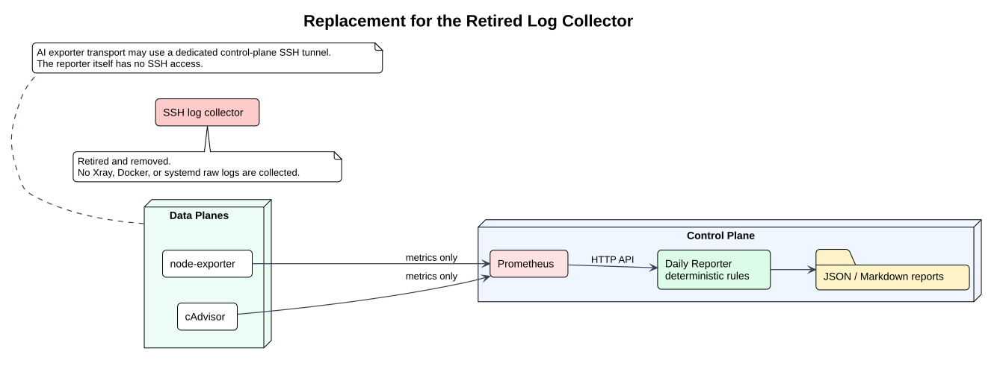

# SSH 日志采集器停用说明

> 状态：已停用，不得部署
> 权威范围：旧 `xray-ops-log-collector` 的生命周期状态
> 最后核验日期：2026-07-31

`xray-ops-log-collector` 已从运行 Compose 和生产容器中移除。Reporter 不通过 SSH 连接数据面，不读取或保存 Xray、Docker、systemd 原始日志，也不再写入日志游标、raw events、五分钟日志 rollup 或采集缺口记录。AI exporter 的指标传输可以使用控制面的专用 SSH 回环隧道，但该隧道不属于 Reporter，也不承载日志或远程命令。

新增的 `xray-ops-attribution-sampler` 不是旧日志采集器的回退。它只读取 Xray `/debug/vars` 的 user/inbound 聚合 counter，采样后立即盐化 HMAC 脱敏，并只写入 counter 快照。它不得读取 access/error log，不得保存原始 user/inbound、客户端 IP、访问域名或请求内容。

替代链路：

[查看 PlantUML 源文件](diagrams/collector-replacement.puml)

- Exporter 部署：[exporter-deployment.md](exporter-deployment.md)
- Prometheus 数据源：[prometheus-targets.md](prometheus-targets.md)
- 规则能力边界：[fault-classification.md](fault-classification.md)

旧 SQLite 遥测数据仅保留为历史归档，不参与新报告判定。是否撤销数据面已有 SSH 公钥是独立安全变更，必须核验具体公钥指纹并另行批准；迁移过程不自动修改 `authorized_keys`。
