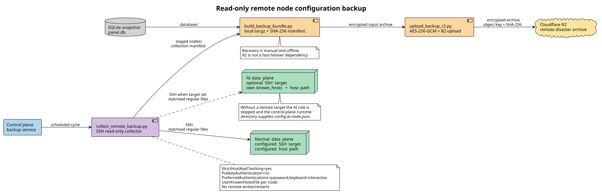

# 远端节点配置采集

本模块只说明控制面如何通过 SSH 读取普通数据面的实际配置，并把结果交给灾备归档器。当前 AI 备用运行在控制面本机 `xray-ai-node`，其配置随控制面运行时目录归档，不通过 SSH 采集。



[PlantUML 源文件](diagrams/remote-backup-flow.puml)

## 采集边界

采集器是 `scripts/collect_remote_backup.py`，在备份容器内运行。每次任务只执行一条受限的远端 `python3 -c` 脚本，该脚本对配置路径执行 `stat` 和只读 `open(..., "rb")`：

- 只接受普通文件；目录、符号链接目标异常、超出大小上限或不可读文件会记录状态。
- 远端进程不写文件、不修改权限、不执行 `systemctl`/`docker restart`，也不会上传或替换配置。
- 内容以 Base64 返回，控制面重新计算 SHA-256 后才落入临时 staging 目录。
- staging 文件和 `remote-node-collection.json` 使用 `0600`；临时 SSH 私钥副本同样为 `0600`，任务结束后清理。
- 私钥、`Docker Secret` 和密码不会写入归档。配置文件在本地打包前是明文，备份目录必须限制为备份服务可读。

## 三个节点的配置来源

灾备归档包含控制面本地文件和普通数据面实际宿主机文件：

```text
database/
config/                         # 控制面 DB_BACKUP_EXTRA_PATHS
nodes/
  normal-data-plane/
    root/xray-routing-panel/app/xray/runtime/config.json
  remote-node-collection.json
backup-manifest.json
```

本次通过只读 SSH 实测的路径如下：

| 节点 | SSH 目标 | 主配置路径 | 可选环境文件 |
| --- | --- | --- | --- |
| 普通数据面 | `root@100.65.108.93:22` | `/root/xray-routing-panel/app/xray/runtime/config.json` | `/root/xray-routing-panel/app/xray/.env` |
| AI 备用 | 本机 Docker `xray-ai-node` | `config/` 下的 `app/xray/runtime/config-ai-node.json` | `config/` 下的 `app/xray/.env` |

普通数据面上的 `/root/xray-routing-panel/app/xray/runtime/config.json` 是宿主机文件，Docker 容器内以只读方式挂载为 `/etc/xray/config.json`。不要把容器内路径误填为宿主机路径；如果部署目录不同，显式覆盖 `DB_BACKUP_DATAPLANE_REMOTE_PATHS`。

控制面自己的配置由 `DB_BACKUP_EXTRA_PATHS` 提供。Compose 默认把 `/app/xray/.env` 和 `/app/xray/runtime` 以只读方式挂载到备份服务，因此普通数据面快照来自 SSH，本机 AI 备用快照来自控制面本地目录。

## 密钥与主机校验

- 默认密钥：`/run/secrets/fleet_ssh_key`；Compose 从 `/root/ssh-keys/xray_fleet_ed25519_20260805` 只读挂载。
- 普通数据面 known_hosts：`/root/.ssh/known_hosts`。
- AI 备用不需要 SSH known_hosts；只有显式启用远端 AI 节点时才配置独立 known_hosts。
- SSH 强制 `BatchMode=yes`、`PreferredAuthentications=publickey`、`PasswordAuthentication=no`、`KbdInteractiveAuthentication=no`、`IdentitiesOnly=yes`、`StrictHostKeyChecking=yes`，并设置连接和存活超时。
- `DB_BACKUP_SSH_OPTIONS` 以及节点级 options 只允许无边界风险的网络/日志选项（`-4`、`-6`、`-q`/`-v` 和连接超时/keepalive）；身份、known_hosts、代理和远端命令选项会被拒绝。
- `/root/ssh-keys` 中的密钥文件如果权限过宽，采集器会复制到任务临时目录并改为 `0600`，避免 OpenSSH 拒绝使用；不会修改源密钥权限。

不要把 root 密码、私钥内容或 R2 Secret Access Key 放在环境变量、日志、Markdown 或归档中。AI 节点当前能够使用统一 fleet 公钥；密码只作为人工应急登录手段，不是自动备份路径。

## 开关与失败策略

| 变量 | 默认值（Compose） | 作用 |
| --- | --- | --- |
| `DB_BACKUP_SSH_COLLECTION_ENABLED` | `1` | 是否采集普通数据面；关闭时仍生成控制面本地灾备归档 |
| `DB_BACKUP_SSH_COLLECTION_REQUIRED` | `0` | `0`：普通数据面失联只写入 manifest；`1`：普通数据面主配置必须成功采集 |
| `DB_BACKUP_SSH_KEY_PATH` | `/run/secrets/fleet_ssh_key` | 只读 SSH 私钥路径 |
| `DB_BACKUP_SSH_TIMEOUT_SECONDS` | `20` | 单节点连接/远端读取超时上限 |
| `DB_BACKUP_SSH_MAX_FILE_BYTES` | `5242880` | 单个远端文件大小上限，默认 5 MiB |
| `DB_BACKUP_DATAPLANE_REMOTE_PATHS` | 实测普通数据面路径 + `.env` | 逗号或换行分隔；第一个路径是必需主配置路径 |
| `DB_BACKUP_AI_NODE_SSH_PORT` | `22` | 仅显式启用远端 AI 节点 SSH 采集时使用 |
| `DB_BACKUP_AI_NODE_REMOTE_PATHS` | 空 | 当前本机 AI 备用不使用远端采集 |

`DB_BACKUP_SSH_COLLECTION_REQUIRED=0` 是灾备优先的默认策略：普通数据面暂时不可达时仍保留控制面数据库和本地配置，manifest 会记录 `failed`、`skipped_no_target` 或文件级 `missing`。需要把普通数据面配置作为发布门禁时才设置为 `1`。

## manifest 与核验

`nodes/remote-node-collection.json` 为每个实际启用的远端节点和每个请求路径记录：

- `status`：节点整体状态（`ok`、`partial`、`failed` 或 `skipped_no_target`）。
- `target`、`sshPort`、`knownHosts`、`requestedPaths`：本次连接参数和请求路径（不包含密钥内容）。
- `path`、`exists`、`mode`、`mtime`、`size`、`sha256`：远端 stat 与内容摘要。
- `stagedPath`：归档内对应文件路径；不包含 Base64 内容。
- `configCollected`：主配置路径是否确实成功写入 staging。

归档根部 `backup-manifest.json` 再记录所有文件的 SHA-256。灾难阶段先验证两层 manifest，再将 `nodes/` 下的配置复制到隔离目录并重新渲染/校验 Xray；不要直接覆盖运行中的配置。

## 只读验证命令

在控制面上执行采集器（不会触碰远端状态）：

```bash
DB_BACKUP_SSH_KEY_PATH=/root/ssh-keys/xray_fleet_ed25519_20260805 \
DB_BACKUP_DATAPLANE_SSH_TARGET=root@100.65.108.93 \
DB_BACKUP_DATAPLANE_SSH_PORT=22 \
DB_BACKUP_DATAPLANE_KNOWN_HOSTS=/root/.ssh/known_hosts \
DB_BACKUP_DATAPLANE_REMOTE_PATHS=/root/xray-routing-panel/app/xray/runtime/config.json,/root/xray-routing-panel/app/xray/.env \
python3 scripts/collect_remote_backup.py --output-dir /var/tmp/xray-remote-staging --required
```

检查输出目录中的 `remote-node-collection.json` 和 `sha256sum`，确认普通数据面 `configCollected` 为 `true`。本机 AI 备用配置应在归档 `config/` 中核验。该命令只在本地 staging 目录写入临时文件；远端命令只执行 `stat`/读取。

## 排障顺序

1. `Permission denied (publickey)`：确认挂载的 key 是 fleet 公钥对应私钥，且 known_hosts 中有目标主机；不要关闭严格主机校验。
2. `Host key verification failed`：更新受控的对应 known_hosts 文件，先人工核对指纹，再重新执行。
3. `missing`：通过只读 `docker inspect`、`systemctl cat` 或部署清单确认宿主机真实路径，再覆盖节点的 `*_REMOTE_PATHS`。
4. `partial`：查看文件级 status；主配置缺失时不要把 `.env` 采集成功误判为完整配置。
5. `too_large`：提高 `DB_BACKUP_SSH_MAX_FILE_BYTES` 前先确认该文件确实属于灾备范围，并评估归档大小和本地/R2 保留成本。

SSH 采集失败不会触发节点重启、配置回滚或 DNS 切换；这些是独立运维流程。R2 上传仍只是加密后的异地灾备通道，不承担快速恢复。
