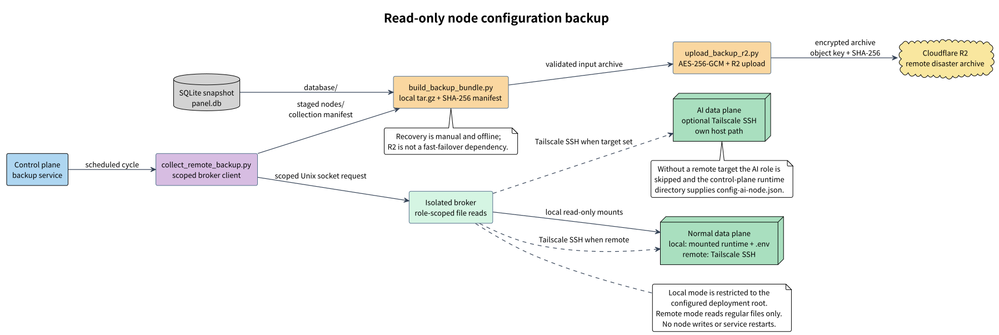

# 节点配置采集

> Type: Runbook
> Status: Active
> Scope: 同机与远端 Xray 节点文件的只读采集、路径映射与恢复材料边界

本模块说明隔离 broker 如何从同机只读挂载或通过 Tailscale SSH 读取数据面实际配置，并将文件纳入灾备归档。未配置远端 AI 目标时，AI 备用运行在控制面本机 `xray-ai-node`，配置随控制面运行时目录归档。其他灾备流程见[灾备归档](disaster-backup.md)，变量默认值见[配置说明](configuration.md)。



[PlantUML 源文件](diagrams/remote-backup-flow.puml)

## 采集边界

采集器 `scripts/collect_remote_backup.py` 对节点路径只执行 `stat` 和只读 `open(..., "rb")`：

- 只接收普通文件；目录、异常符号链接、超限或不可读文件会写入状态。
- 远端不写文件、不改权限、不运行 `systemctl` 或 `docker restart`，也不会上传或替换配置。
- 文件内容以 Base64 返回；控制面重新计算 SHA-256 后才写入临时 staging 目录。
- 节点主配置和 `.env` 是恢复必需文件，运行时辅助产物是可选文件。
- staging 文件和 `remote-node-collection.json` 权限为 `0600`。配置在本地加密前是明文，备份目录必须限制为备份服务可读。

## 节点来源

| 角色 | 目标 | 默认路径与恢复来源 |
| --- | --- | --- |
| 普通数据面 | 同机时将 `DB_BACKUP_DATAPLANE_SSH_TARGET` 设为 `local`；远端时设 SSH 目标并回退到 `DATAPLANE_SSH_TARGET` | `/root/xray-routing-panel/app/xray/runtime/config.json`、`.env` 和可选运行产物 |
| 远端 AI 节点 | `DB_BACKUP_AI_NODE_SSH_TARGETS`，兼容 `AI_NODE_SSH_TARGETS` 和单目标别名 | `/etc/xray/config.json`、`/etc/xray/.env`；按实际宿主机路径覆盖 |
| 本机 AI 备用 | 无远端 AI 目标时读取控制面归档 | `app/xray/runtime/config-ai-node.json` 和 `app/xray/.env` |

每个远端 AI 目标都会生成一个恢复角色。单目标使用 `ai-data-plane`；多目标使用 `ai-data-plane-<node-id>`，其中 `AI_NODE_IDS` 按顺序提供后缀，未提供时使用序号。恢复时以 manifest 中的完整角色名为准。

`nodes/<role>/` 保留远端绝对路径（去掉开头的 `/`）；`node-recovery-manifest.json` 再按节点部署根映射为便携恢复路径。路径位于部署根下时去掉根前缀，否则按文件名映射到固定的配置路径；各节点保存在独立目录中，不会互相覆盖。AI 默认路径 `/etc/xray/*` 不在默认部署根下，生产环境应按实际部署设置 `DB_BACKUP_AI_NODE_REMOTE_PATHS` 和 `DB_BACKUP_AI_NODE_DEPLOY_ROOT`。

## Tailscale 访问

- Compose 默认使用 `DB_BACKUP_SSH_TRANSPORT=tailscale-broker`。隔离的 `xray-routing-panel-db-backup-tailscale` 服务执行 Tailscale SSH，备份容器只连接 `/var/run/xray-backup/tailscale-ssh.sock`。
- 普通数据面目标为 `local` 时，broker 从 `DB_BACKUP_DATAPLANE_LOCAL_RUNTIME_HOST` 和 `DB_BACKUP_DATAPLANE_LOCAL_ENV_HOST` 读取文件；两个挂载只对 broker 可见且为只读。读取路径必须位于 `DB_BACKUP_DATAPLANE_DEPLOY_ROOT` 内。
- 其他普通数据面目标和远端 AI 目标仍通过 Tailscale SSH 只读采集。broker 只接受恢复角色和文件大小上限；目标、路径和读取方式由 broker 配置决定，不挂载项目、数据库、归档或 R2 凭据。
- 宿主机 Tailscale CLI 和 daemon socket 只挂载到 broker；备份容器只挂载 broker socket。Tailscale 身份、节点授权和主机校验由宿主机 daemon 与 Tailscale ACL 管理。
- Tailscale 模式不读取 `known_hosts`、不使用私钥，也不接受 OpenSSH options。受信任主机上直接运行采集器可设 `DB_BACKUP_SSH_TRANSPORT=tailscale`；受控兼容环境可用 `openssh`。

Compose 默认关闭节点采集和完整性门禁。完整节点备份需启用 `DB_BACKUP_SSH_COLLECTION_ENABLED`、`DB_BACKUP_SSH_COLLECTION_REQUIRED` 和 `DB_BACKUP_RECOVERY_REQUIRED`。普通数据面可设 `local` 并配置两个本机只读源路径，或设有效的远端 Tailscale SSH 目标；远端 AI 目标仍通过 broker 的 Tailscale SSH 读取。缺少目标、挂载或必需恢复文件时，门禁会阻止归档上传；未配置远端 AI 目标时，本机 AI 文件仍从控制面归档。

## Manifest 与验证

`nodes/remote-node-collection.json` 为每个远端角色和请求路径记录状态、目标、路径、文件大小、SHA-256、采集结果及 `recoveryReady`。归档根部的 `backup-manifest.json` 校验归档文件；`node-recovery-manifest.json` 描述恢复角色和便携路径。先用 `scripts/node_recovery.py validate --bundle <bundle> --require-ready` 检查，再运行 `prepare` 将节点文件复制到隔离目录；不要直接覆盖运行中的配置。恢复过程见[节点恢复](node-recovery.md)。

可在控制面上验证普通数据面采集。若当前环境设置了 AI 目标别名，清除或显式覆盖它们，避免命令同时采集 AI 节点。

同机部署时，Compose 服务需要设置 `DB_BACKUP_DATAPLANE_SSH_TARGET=local`，并把普通节点的 runtime 目录和 `.env` 宿主机路径填入两个 `DB_BACKUP_DATAPLANE_LOCAL_*_HOST` 变量。broker 重建后，备份容器通过 broker socket 请求采集；不会对本机发起 SSH。

```bash
DB_BACKUP_SSH_TRANSPORT=tailscale \
DB_BACKUP_TAILSCALE_BIN=/usr/bin/tailscale \
DB_BACKUP_TAILSCALE_SOCKET=/var/run/tailscale/tailscaled.sock \
DB_BACKUP_DATAPLANE_SSH_TARGET='root@<normal-data-plane-host>' \
python3 scripts/collect_remote_backup.py \
  --output-dir /var/tmp/xray-remote-staging --required
```

## 故障排查

- `Tailscale SSH CLI is unavailable`：确认 `DB_BACKUP_TAILSCALE_BIN_HOST` 指向宿主机 CLI，并重建 broker 容器。
- `Tailscale daemon socket is unavailable`：确认宿主机 `tailscaled` 正常运行，并检查 `DB_BACKUP_TAILSCALE_SOCKET_HOST`。
- `Tailscale SSH broker is unavailable`：确认 broker 健康检查通过，备份容器的只读 socket 挂载正常。
- `local` 目标下 required 文件缺失：确认 runtime 和 `.env` 两个宿主机源路径存在、只读挂载已应用，并且目标文件位于 `DB_BACKUP_DATAPLANE_DEPLOY_ROOT` 下。
- `SSH collection failed`：确认 Tailscale ACL 授权 broker 身份连接目标，并在宿主机用同一目标执行只读 `tailscale ssh`。
- `missing` 或 `partial`：根据文件级状态核实宿主机路径，并覆盖对应的 `*_REMOTE_PATHS`。
- `too_large`：确认文件确属灾备范围后，再评估是否提高 `DB_BACKUP_SSH_MAX_FILE_BYTES`。

采集失败不会触发节点重启、配置回滚或 DNS 切换；这些属于独立运维流程。R2 仅保存加密灾备归档，不负责快速恢复。
