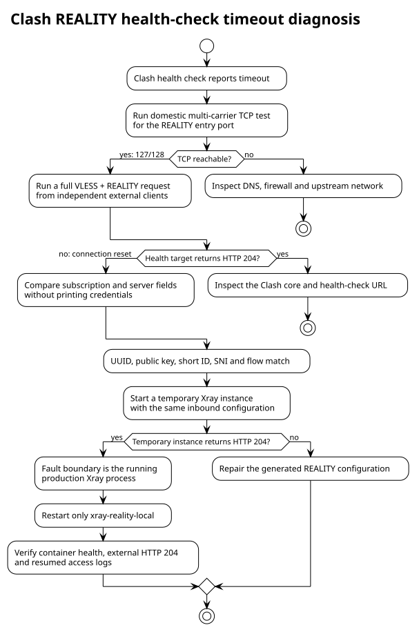

# Clash REALITY 健康检查超时排障记录

本文记录 2026-09-03 `ai.zrhe2016.cc:31098` 在 Clash 中显示 `check timeout` 的故障定位、修复和验收结果。文档只记录故障边界与可复用步骤，不记录订阅令牌、UUID、REALITY 私钥或其他租户凭据。

## 结论

`31098` 的 TCP 端口在国内三网基本可达，但当时生产 Xray 进程会重置有效的 VLESS + REALITY 握手，因此 Clash 无法访问健康检查目标并显示超时。

订阅内容和磁盘上的服务端配置一致；使用同一份 inbound 配置启动的临时 Xray 实例能够正常返回 HTTP 204。仅重启生产容器 `xray-reality-local` 后，完整协议检查和国内实际流量均恢复。

已确认的直接故障点是生产 Xray 进程的运行状态，而不是订阅接口、租户参数、DNS 或国内到 `31098` 的普遍网络阻断。进程为何进入该异常状态没有足够证据，不将其归因于某个未验证的 Xray 缺陷。

## 排障流程



[PlantUML 源文件](../diagrams/clash-reality-health-check.puml)

## 影响范围

- 客户端现象：Clash 节点测速或健康检查显示 `timeout`。
- 故障入口：普通数据面上的 VLESS + REALITY 入口 `ai.zrhe2016.cc:31098`。
- 未受影响：租户订阅接口仍返回 HTTP 200，生成的 Clash YAML 可正常解析。
- 端口层表现：TCP 三次握手大多成功，但完整 REALITY 握手失败。
- 协议层表现：健康检查请求未到达目标站点，客户端收到连接重置。

## 关键证据

| 检查层级 | 故障期间结果 | 判定 |
| --- | --- | --- |
| 订阅接口 | HTTP 200，Clash YAML 有效 | 订阅服务正常 |
| 配置一致性 | UUID、公钥、short ID、SNI、flow 全部匹配 | 排除订阅与磁盘配置失配 |
| 容器健康检查 | `running / healthy`，`xray run -test` 返回 `Configuration OK` | 只证明配置可解析，不能证明数据面可用 |
| 国内 TCP 拨测 | 128 个电信、移动、联通节点中 127 个成功，中位延迟约 162 ms | 排除端口在国内普遍不可达 |
| 域名与直连 IP 对照 | 两者均为 127/128 成功，失败点相同 | DNS 不是本次主因 |
| 完整协议检查 | 独立美国、台湾 Xray 客户端均收到连接重置 | Clash timeout 可在服务端外部复现 |
| 生产进程内外网对照 | 通过公网地址和 Tailscale 地址访问同一生产进程均失败 | 排除公网入口单一路径问题 |
| 同配置临时实例 | 外部客户端经 VLESS + REALITY 访问健康目标返回 HTTP 204 | inbound 配置内容有效，故障收敛到生产进程状态 |

端口探测只能验证 TCP 握手，不能代替 VLESS + REALITY 的完整代理检查。因此“端口在线”和“Clash 健康检查超时”可以同时发生。

## 修复操作

故障边界确认后，只重启异常的生产 Xray 容器，没有修改订阅或 REALITY 参数：

```bash
docker restart xray-reality-local
```

重启时间为 2026-09-03 02:44 UTC。容器恢复监听后，健康状态从 `starting` 转为 `healthy`。

## 修复后验收

重启后执行以下验证：

1. `xray-reality-local` 状态为 `running / healthy`。
2. `31098` 重新处于监听状态。
3. 美国外部客户端通过公网完成 VLESS + REALITY 请求，健康目标返回 HTTP 204。
4. 台湾外部客户端执行相同请求，健康目标返回 HTTP 204。
5. Xray access log 再次出现来自国内公网地址的真实代理流量。

以上条件同时满足后，本次故障判定为已恢复。

## 可复用排障顺序

### 1. 区分端口可达与协议可用

先从客户端网络以外的位置测试入口端口：

```bash
timeout 5 bash -c 'exec 3<>/dev/tcp/<node-host>/<node-port>'
```

TCP 成功只说明监听、防火墙和基础路径可用。仍需使用配置正确的外部 Xray 或 Mihomo 客户端，通过该节点访问一个 `generate_204` 目标。

### 2. 检查生产容器与监听

```bash
docker inspect -f \
  'status={{.State.Status}} health={{if .State.Health}}{{.State.Health.Status}}{{else}}none{{end}}' \
  xray-reality-local

ss -ltnp '( sport = :<node-port> )'
```

不要把 `Configuration OK` 当作代理可用性的充分条件；当前健康检查主要验证配置语法。

### 3. 比较配置但不输出凭据

至少核对以下字段是否一致：

- 客户端 UUID；
- `flow`，本入口为 `xtls-rprx-vision`；
- REALITY 公钥与服务端私钥派生结果；
- short ID；
- 客户端 `servername` 与服务端 `serverNames`；
- 节点地址和端口。

检查脚本只应输出 `match/no-match`，不得打印原始值。

### 4. 使用同配置临时实例缩小边界

如果生产进程完整握手失败而字段全部匹配，可在未占用的临时端口启动同版本、同 inbound 配置的 Xray，并通过 Tailscale 或受控防火墙从外部复测：

- 临时实例也失败：继续检查生成配置、伪装目标和 Xray 版本兼容性。
- 临时实例成功：故障收敛到当前生产进程或其加载状态，再考虑重启生产容器。

测试结束后必须停止并删除临时实例，不开放长期公网入口。

### 5. 重启后的验收门禁

重启不能单独作为完成标准。必须同时满足：

- 容器健康；
- 端口监听；
- 至少一个独立外部客户端完成 REALITY 握手；
- 通过代理访问健康目标返回 HTTP 204；
- access log 出现新的有效代理请求。

## 后续改进

当前容器健康检查使用 `xray run -test`，无法发现“配置合法但完整握手失败”。建议后续单独实现外部合成探测：

1. 从数据面以外的受控探针发起真实 VLESS + REALITY 请求。
2. 将 HTTP 204、握手耗时和失败原因写入监控指标。
3. 对连续失败和 Xray 异常重启次数告警。
4. 保留 TCP 探测作为网络层指标，但不以其替代协议层健康状态。

合成探针应从密钥管理系统读取最小权限测试凭据，不得把生产租户订阅链接或私钥写入代码、日志和监控标签。
