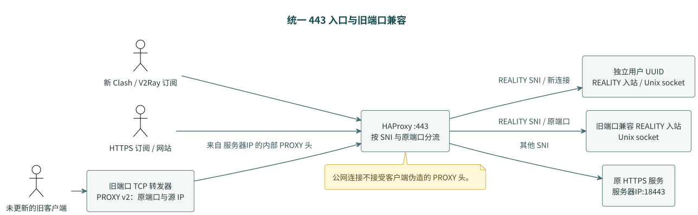

# Clash 统一 443 入口

> Type: Runbook
> Status: Active
> Scope: Clash 统一 443 入口

启用后，新获取的 Clash 和 V2Ray 订阅统一连接 `server:443`。已有订阅 URL、
HTTP 80/8080 和 HTTPS 443 的订阅下载保持可用；未更新的客户端仍可使用原代理端口。
此功能需要部署网关后显式开启，单独修改订阅端口不会自动迁移线上监听。



[PlantUML 源文件](diagrams/unified-entry.puml)

443 由 HAProxy 监听：REALITY SNI 进入代理，其余 SNI 进入原 HTTPS 服务。
原代理端口由独立的 TCP 转发器监听。转发器发送带原目标端口和源 IP 的 PROXY v2 头，
443 再交给对应的兼容入站。内部入站使用 Unix socket，不另外暴露 TCP 代理端口。
这里保留内部兼容入站是为了让原来的共享 UUID 和按端口配额继续有效。

## 配置与计费

在控制面的 `app/xray/.env` 设置：

```dotenv
XRAY_UNIFIED_PORT=443
XRAY_UNIFIED_UUID_SECRET=<至少 32 字符的私有随机值>
```

统一入口端口不能同时作为某个租户的旧监听端口；如果数据库中已经有租户占用
`443`，须先迁移该租户的旧端口，再启用统一入口。

每个账号按原端口标识通过 HMAC 派生独立 UUID。这个密钥须备份；更换它会改变
新订阅 UUID，不能用所有旧客户均可见的 `XRAY_CLIENT_UUID` 代替。
新的 UUID 只在 443 有效，旧 UUID 只在旧兼容端口有效。
旧端口流量与新 `panel-user-{port}` 用户流量相加，仍计入原来的账号配额。
停用、到期或超额后，配置会同时移除该账号的新 UUID 与旧端口兼容入站。
没有活跃账号时保持空客户端列表，不回退为共享账号。

## 部署顺序

普通数据面必须安装、验证此入口，之后才能发布 443 订阅。若启用了控制面备用
Xray，控制面也必须部署等价的 TCP 网关；控制面现有 Nginx 通常已经占用 443，
不能直接套用本目录的普通数据面 unit，必须先完成 Nginx/备用入口的端口切换设计。
AI 节点使用独立凭据和监听端口，不参与此迁移。

1. 备份两端实际 Xray 配置、控制面 `.env`、客户端配置、订阅服务及其 systemd
   配置。检查 443 当前所有使用者；本部署的 HTTPS 服务为 `verge-sub`。
2. 安装 HAProxy（已验证 2.8 配置语法）。将 `scripts/render_entry_gateway.py`
   和 `scripts/run_subscription_backend.py`、`scripts/cleanup_xray_sockets.py`
   安装至 `/usr/local/lib/xray-entry/`。
   如果主机启用了 `ai-routing-panel-firewall.timer`，同时安装
   `deploy/normal-data-plane/sync-ai-routing-panel-firewall.sh`；统一模式下 Xray
   使用 Unix socket，防火墙必须从统一配置读取 443 和旧端口别名，不能只扫描
   Xray 容器的 TCP 监听。
3. 安装 `deploy/normal-data-plane/xray-entry.service`、
   `xray-legacy-forwarder.service`、`xray-socket-cleanup.service`、`xray-entry-refresh.service` 和
   `xray-entry-refresh.path` 至 `/etc/systemd/system/`。配置 `/etc/xray-entry.env`：

   ```dotenv
   XRAY_ENTRY_CONFIG=/root/xray-routing-panel/app/xray/runtime/config.json
   XRAY_ENTRY_SOCKET_DIR=/root/xray-routing-panel/app/xray/logs
   ```

   这里必须指向 Docker 实际挂载的配置和日志目录。若路径不同，也须修改 `.path`
   监听的路径。`.path` 在增删账号或到期移除端口后重新生成并平滑重载 HAProxy。
   执行 `systemctl daemon-reload` 和 `systemctl enable xray-socket-cleanup.service`。
   清理服务在 Docker 每次启动前运行，只删除名称匹配的、连接明确返回
   `ECONNREFUSED` 的 socket；保留活跃 socket、普通文件和符号链接。
   这可防止 VPS 重启后残留 socket 导致 Xray 报 `bind: address already in use`，
   进而阻止控制面启动。清理服务自身失败不会阻止其他 Docker 服务启动。
4. 暂停控制面的配置写入进程，生成统一模式的候选 Xray 配置。使用实际运行版本的
   `xray run -test -config ...` 校验；用 `render_entry_gateway.py` 校验 HAProxy
   配置。保留已有 REALITY SNI、密钥、AI 路由和备用出站配置。
5. 将 `verge-sub-unified.conf` 安装为
   `/etc/systemd/system/verge-sub.service.d/unified-entry.conf`，执行
   `systemctl daemon-reload`。该包装器只把原服务的 TLS 监听改到回环 18443，
   不修改原服务源码。切换 Xray、重启 `verge-sub` 并启动 `xray-entry`。
6. 普通数据面验证 HTTPS 订阅/网站、新 443 和每个旧端口的真实 REALITY 握手与 HTTP
   请求；确认新旧账号统计均增加。控制面备用只有在完成独立网关和 Nginx 端口切换
   后才做同样的验证。成功后启用网关及路径监听的开机启动，更新订阅生成代码、
   恢复控制面配置写入进程。原 `verge_sub/node_info.json` 若也提供节点
   订阅，必须同步为对应活跃账号的 443 UUID，不能保留旧共享 UUID。

HAProxy 仅对来自内部转发器专用回环源地址的连接接受 PROXY 头。公网连接不接受客户端
伪造的 PROXY 元数据；Xray 的 Unix socket 不对公网开放。

## 验证与回退

`scripts/smoke_unified_entry.py` 接收实际的 `--server-config`、`--client-config`、
`--host` 和 `--xray` 路径，验证每个新账号和旧端口，且验证旧共享 UUID 在 443
被拒绝。不打印 UUID、私钥或订阅令牌。需要在两端都运行，并从公网客户端验证
入口防火墙与 DNS 路径。

集成测试可执行：

```bash
XRAY_TEST_BINARY=/path/to/xray python -m pytest -q tests/test_unified_entry_integration.py
```

此测试启动临时 Xray、HAProxy、HTTP/HTTPS 服务，使用临时凭据，REALITY 握手
目标为 `www.amazon.com:443`，需要能够直连该站点。

若切换失败，先暂停配置写入与路径监听，停止 `xray-entry`，恢复备份的多端口
Xray 配置、`.env`、客户端订阅文件及原订阅服务启动配置，再重启 Xray 和
`verge-sub`。必须同时恢复订阅输出，避免仍发布未监听的 443 代理节点。

## 超额账号的 5 Mbps 限速

启用账号限速后，到达配置配额的账号保留旧端口、新 UUID 和订阅下载；手动停用与
到期仍不可用。`100G` 沿用现有二进制单位，等于 `107374182400` 字节，上传与下载
累计之和达到配额即进入超额状态。限速是上传、下载**各** `5000000` bits/sec，
同一账号所有并发连接与旧端口/443 共用预算；协议和 IP 头开销计入内核速率，应用
吞吐略低于 5 Mbps。重置流量或增加配额后解除限速，累计流量不因限速清零。
历史 `enabled=0` 记录没有可靠的停用原因，不自动恢复；重置不启用已停用账号。

Xray 26.5.3 没有原生账号速率配置。`XRAY_ACCOUNT_LIMITS_ENABLED=1` 将认证后的
账号路由到带标记的独立普通/AI 出站；旧兼容入站与统一用户邮件标识绑定同一标记。
所有启用账号始终标记，只有超额账号加入队列，因此跨过配额和解除限速不需要重启
Xray。静态 QUIC 禁止规则优先，原 AI 域名/全部流量范围保持不变。不能使用共享
443 端口或客户源 IP 代替认证账号；不支持链式 dialerProxy/proxySettings 或 balancer。

普通数据面安装 `scripts/apply_account_limits.py` 和 `app/xray/account_limits.py`
至同一受保护目录，例如 `/usr/local/lib/xray-account-limits/`。节点需 `ip`、`tc`、
`nft`、IFB/HTB/flower/act_ct；脚本以 root 执行。实际 Xray 容器须 host 网络、绑定
被检查配置，进程具备 SO_MARK 权限（CAP_NET_ADMIN，或 Linux >=5.17 的 CAP_NET_RAW）。
只读配置校验不能证明套接字标记已生效。

在控制面进程配置 `DATAPLANE_ACCOUNT_LIMITS_COMMAND`，使用已有数据面 SSH 传输：

```text
python3 /usr/local/lib/xray-account-limits/apply_account_limits.py --apply --interfaces eth0 tailscale0 --config /root/xray-routing-panel/app/xray/runtime/config.json --xray-container xray-reality-local
```

命令从 stdin 接收版本化的账号策略，不包含 UUID、密码或流量计数。先在隔离环境
验证并完成独立预检，再一致启用标记渲染与节点命令。默认渲染开关关闭；开关未启用、
命令缺失或能力不足时超额账号显示待配置/失败，不能宣称真实限速。控制面备用入口
需另行安装等价能力，普通数据面的回执不能证明备用节点生效。

脚本只管理 `inet xray_account_limits`、`xral-up`/`xral-down` IFB 和 tc 优先级
49150/49151、链 49150，以及 IFB 内部分类器优先级 49152；标记 `0x50000000 | account_port` 使用掩码 `0xff00ffff`，
保留 Tailscale 的 `0x00ff0000`。上传及返回下载分别汇入跨 eth0/tailscale0 共享的
账号 HTB 类，rate=ceil=5Mbit，不替换物理网卡已有根队列。外来同名资源阻止应用。

维护周期检查策略 hash、节点 boot ID、真实进程权限、规则及速率，并更新回执。
只有该账号上传/下载类计数均实际增加才显示已生效；无连接时显示“已配置，待连接
验证”。回执过期或策略不一致显示待应用。节点重启后内核队列丢失，维护周期重建；
新队列需要连接验证。新旧版本策略或应用失败不会伪造成功回执。

回退时暂停控制面配置写入，使用同一接口/配置/状态路径执行 `--remove`（不传
`--apply`）。仅删除该脚本拥有的规则与 IFB；原已存在 clsact 与根队列保留。恢复
旧源代码、`.env`、配置和订阅产物后按原流程重新加载 Xray。禁止只关闭渲染开关却
留存孤立内核规则。首次部署与回退均验证 HTTPS、管理入口、未超额账号和真实认证
账号双向传输；配置已接受与实测生效是两个不同结果。
